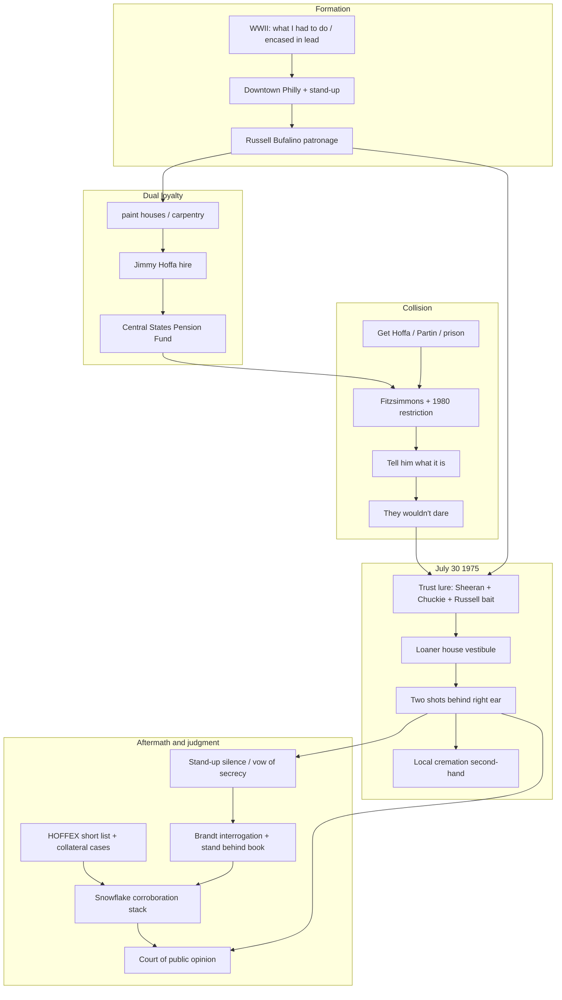

# Synthesis: I Heard You Paint Houses

Reading purpose: **"bản study đầy đủ — hiểu sâu toàn bộ sách, không chỉ tóm tắt"** (full analytical study of the work as history/confession, not a plot summary alone).

Page cites refer to synthetic pages in `source.txt` (~500 words/page), not the printed edition.

---

## 1. What is the book about as a whole?

*I Heard You Paint Houses* is Charles Brandt’s oral-history reconstruction of Frank “The Irishman” Sheeran’s life as the continuous path that ends with the July 30, 1975 disappearance of Jimmy Hoffa. (pp. 5–6)

It is not a courtroom brief and not a novel. Brandt frames it as **history from tape-recorded interviews**, meant to supply the “final chapter” of a case that official investigators closed as an unfinished “whodunit.” (pp. 4–5) Sheeran’s words are offered to the **court of public opinion**. (p. 6)

Unity of the work rests on three interlocking strands:

1. **Formation of a killer** — Depression childhood, WWII combat ethics (“what I had to do,” “encased in lead”), trucking, then Bufalino patronage and downtown Philly. (pp. 19–68)
2. **Dual loyalty** — Sheeran serves two “greatest men,” Hoffa and Russell Bufalino, until their interests collide over Teamsters power and the Central States Pension Fund. (pp. 7–9, 83–85, 193–196)
3. **Confession of the hit** — Sheeran claims he was the shooter in a Detroit house after luring Hoffa with trust, Chuckie O’Brien, and the implied presence of Bufalino; then decades of stand-up silence until deathbed-era affirmation. (pp. 199–210, 229)

The whole-book question the text answers is: **Who killed Hoffa, and how does Sheeran’s entire century make that answer intelligible?**

---

## 2. What is said in detail, and how?

### A. Method frame (Prologue)

Brandt opens with institutional and family facts that pre-load credibility for a Sheeran-centered solution:

- FBI found “Russ & Frank” on Hoffa’s yellow pad. (p. 2)
- Serious secondary literature already named Sheeran as perpetrator under Bufalino’s sanction (Moldea, Brill, Sloane). (p. 3)
- James P. Hoffa: his father would have gotten into a car with Sheeran. (p. 3)
- Barbara Crancer’s appeals for truth under a vow of secrecy; FBI seeks a deathbed confession; federal and Michigan files close without charges. (pp. 3–5)
- Brandt’s interrogative method: assume the subject wants to confess; keep him talking; protective legal language during most interviews so words are not a courtroom confession; manuscript approved chapter by chapter; final hospital video without protective language. (pp. 5–6)

**How it works rhetorically:** the prologue converts a cold case into a *confession problem* rather than a *missing-evidence problem*.

### B. Opening on the week of the crime, then origin flashback (Ch1–3)

Brandt’s structure is crime-first: Sheeran’s “peace mission” call of July 27, 1975, from his own phone (claim: not yet “in on the thing”), Hoffa’s recklessness after the Nixon pardon, Appreciation Night sit-down where Bufalino says stop running and “tell him what it is,” Hoffa’s “They wouldn’t dare,” Red Fox meet with Tony Pro, Brutico’s delay, “dust to dust,” and the Detroit “errand.” (pp. 6–19)

Only then does Chapter Three open the childhood that will make the instrument legible: paternal boxing, Catholic confession culture, Depression theft, Italian neighborhood language. (pp. 19–23)

### C. War school and the making of cold work (Ch4–7)

WWII (45th “Killer Division,” Anzio, 411 combat days) teaches Sheeran two iron habits: kill when ordered, control feeling so fear does not make you stupid. (pp. 31–44) Brandt and Sheeran treat war as the moral university that later mob work only reuses—“what I had to do” for POWs maps onto ordered civilian hits. (pp. 41, 68)

Postwar America: trucking, Teamsters cover, hair-trigger violence, “encased in lead.” (pp. 43–50)

### D. Bufalino certifies the enforcer (Ch8–10)

South Philly “downtown,” Skinny Razor, stand-up conduct after a Food Fair case, Apalachin as the moment Sheeran grasps Bufalino’s rank, life-debt after nearly crossing Bruno’s “Jew mob,” and the Whispers hit ordered in wartime language: “do what you gotta do.” (pp. 51–68)

**Claim structure:** Sheeran is not “made” (Italian-only), yet Bufalino places him above ordinary outsiders—exactly the non-Italian asset Giuliani’s RICO list later freezes into institutional form. (pp. 6, 64)

### E. Hoffa hire and the title code (Ch11–14)

Hoffa’s rise is framed as labor warfare that already used hoodlums on both sides; “resistance” means national syndicate muscle; McClellan/RFK become permanent enemies. (pp. 70–76)

The title exchange:

- Hoffa: “I heard you paint houses.”
- Sheeran: “I do my own carpentry work, too.” (pp. 10, 83)

That hire embeds Sheeran in International-level enforcement. The **Central States Pension Fund** is presented as the golden goose of LCN loans and under-table points—the structural stake that later makes Fitzsimmons preferable to a vengeful comeback Hoffa. (pp. 84–85)

Early jobs (Chicago sidewalk message hit, picket muscle, suite life with Hoffa/Giancana talk) lock dual loyalty: Russell’s man working for Jimmy. (pp. 90–98)

### F. Envelopes, messages, mockery of justice (Ch15–17)

Ritual cash (“envelope of respect”), political and union “messages,” Philly Voice wars, and the Get Hoffa machine. Test Fleet and Partin convert the RFK feud into felony process that Sheeran and Brandt both read as mutual cynicism—government saturation and Hoffa’s counter-corruption. (pp. 99–125)

### G. Legal wars, prison, comedy troupe (Ch18–21)

Master Freight power peaks as indictments land. Chattanooga/Chicago convictions, Partin as constitutional and factual bomb, Supreme Court defeat, “comedy troupe” post-conviction stunts, creation of general vice president for Fitz, Lewisburg entry March 7, 1967, and Sheeran’s first cold Fitz hang-up (“One down. Two limping”). (pp. 126–155)

JFK-adjacent material (Ragano order talk; Sheeran’s claimed rifle courier role; “just another lawyer now” on funeral day) is held in the notes as **claimed atmosphere with source limits**, not as the book’s load-bearing proof of Dallas. (pp. 129–134, 194–195)

### H. Collision course (Ch22–26)

Prison side-channels; Pro feud; dual cash to Mitchell; resignations sold for parole; **conditional commutation barring labor management until 1980**—the structural lockout. (pp. 156–170)

Sheeran remains Hoffa’s courier and banquet man while remaining Russell’s shooter (Gallo claim at Umberto’s) and political favor-doer. (pp. 173–183)

Broadway Eddie’s / Appreciation Night (Oct 1974): Russell and Angelo tell Hoffa not to run; soft “Dallas” debt; “tell him what it is.” Hoffa refuses: union is his; records will make “all hell… break loose.” (pp. 188–196)

**Argument of the middle third:** dual loyalty is stable only while Hoffa and Commission goals align. Public threats to expose loans and racketeers end the alignment.

### I. July 30, 1975 — the confession core (Ch27–29)

Operational claim (Sheeran first person):

1. Wedding cover; Pro pension beef as decoy; Red Fox public meet. (p. 198)
2. “Kill me or put me in the thing”—participation as trust test. (p. 199)
3. Port Clinton air bridge while wives smoke; loaner Ford; house directions past Red Fox. (pp. 199–201)
4. Cast: Sally Bugs, two cleaners (Andretta circle), Chuckie as dupe in maroon Mercury, Sheeran as trusted backup who is the shooter; Russell as final bait who would “not be there” if violence were expected. (pp. 202–206)
5. Vestibule: empty house = recognition; two shots “in the back of the head behind his right ear.” (p. 207)
6. Local disposal, not drum/Giants Stadium; cremation second-hand from Russell (funeral parlor vs. Vitale incinerator left uncertain). (pp. 201, 207–210)
7. Vesuvio report to Fat Tony: New York didn’t sanction but didn’t oppose; Detroit/Chicago needed. (p. 208)
8. Daughter Peggy: “I don’t even want to know a person like you.” (p. 210)

### J. Aftermath and corroboration stack (Ch30–31, Afterword, Epilogue)

HOFFEX short list matches the cast; collateral prosecutions as Capone/tax strategy; Sheeran claims Sally Bugs silenced March 1978; decades of non-flip under wires, immunity, prison. (pp. 211–223)

Brandt’s afterword: house found from directions; Fox “I shot Jimmy Hoffa”; forged Hoffa letter stress test; video “I stand behind what’s written”; “real estater” late slip. (pp. 223–235)

Epilogue “snowflake → avalanche” stack: Mercury rear-seat hair DNA (Hoffa); Luminol trail geometry; floorboard male blood **not** Hoffa DNA; back door removed in 1989 still in garage; Sloane/Baden endorsements; Gallo lone-gunman journalist ID; Dolores on lifelong guilt. (pp. 235–246)

---

## 3. Is it true, in whole or in part?

History-genre discipline: separate **layers of claim**.

### What is relatively solid (public chronology / institutional anchors)

- Hoffa’s fame, McClellan/RFK war, Test Fleet / jury-tampering path, Lewisburg, Nixon commutation with 1980 restriction, July 30 disappearance, HOFFEX-era focus on a short list including Sheeran, Bufalino, Pro, Briguglio, Andrettas, Giacalone, O’Brien. (pp. 70–76, 126–170, 196–198, 211)
- Secondary literature long treated Sheeran as a central suspect before this book’s first-person detail. (p. 3)
- James P. Hoffa’s statement that his father would enter a car with Sheeran is independent family belief, not Sheeran’s invention. (p. 3)
- 2001 FBI DNA: hair from the maroon Mercury’s rear passenger headrest matches Hoffa—supports *someone* had Hoffa in that car’s rear seat area, compatible with Sheeran’s seating story and not with “never in that car.” (p. 239)

### What is Sheeran-only confession (cannot be verified from this book alone)

- That Sheeran personally fired the two shots in that vestibule. (p. 207)
- Exact cast choreography (Chuckie as pure dupe; Sally’s exact role; Andretta “cleaners”). (pp. 202–207)
- Local cremation site and method (second-hand; Sheeran allows possible misdirection). (pp. 209–210)
- Sole-shooter Gallo hit and many earlier “paint houses” jobs. (pp. 93–94, 173–178)
- Mitchell suitcase cash, many envelope/message jobs, rifle-courier Dallas talk. (pp. 106, 165, 194–195)

### What Brandt’s corroboration strengthens — and where it fails

| Claim area | Strengthens | Fails / incomplete |
| --- | --- | --- |
| House geometry | Directions work; vestibule “box canyon”; back door restored by owner statement (pp. 224–226, 238–239) | Finder guided by confessant; house not independently selected |
| Blood | Luminol trail matches path (p. 237) | Floor DNA **not** Hoffa (p. 237–238) |
| Car | Rear-seat hair DNA (p. 239) | Does not identify shooter; trunk myths already denied by Sheeran (p. 205) |
| Method authenticity | Nerves, take-backs, forged letter exposed, final stand-behind (pp. 223–229) | Manuscript co-construction; protective legal language earlier; self-serving memory |
| Gallo control case | Capeci Seedman lone-gunman; decades-later eyewitness ID (pp. 240–245) | Single delayed witness; transfer of credibility is interpretive |
| Real estater | Coffey tip → John Francis as realtor (pp. 235–236) | Role in 1975 still inferred from a mumble |

### Verdicts (Adler etiquette)

1. **The author is incomplete, not simply “wrong,” on forensic finality.** The book claims to “solve” Hoffa for public opinion (Baden/Sloane language, pp. 237–238), but the strongest failed test (floor DNA) means the case remains cumulative narrative + partial forensics, not a closed lab identification. Brandt sometimes overclaims certainty relative to what his own epilogue reports.

2. **The core July 30 logistics are coherent as operational fiction *or* truth** — corpse-car argument, air-bridge alibi, trust-lure psychology, multi-family politics are internally consistent with mob practice as the book itself describes it. Coherence is not proof; it is a reason the confession has been taken seriously.

3. **Cannot verify from this text alone** whether Sheeran inflated his role (common in deathbed gangster narratives) or told the essential truth. The dual-loyalty motive (survive only by painting Hoffa’s house) is psychologically plausible and matches daughter Dolores’s later testimony of lifelong guilt (p. 246), but motive-plausibility is still not third-party proof of the trigger pull.

4. **JFK material is the weakest major strand** for the book’s own main thesis. Even if some Dallas-adjacent talk appears in Sheeran’s reports (pp. 96–97, 194–195), the Hoffa solution does not require it; treating it as atmosphere rather than load-bearing fact is the honest reading.

**Net judgment:** Partly true as **institutional history of Teamsters–mob power and the known suspect universe**; **plausible but not forensically sealed** as **Sheeran-the-shooter**; **stronger as oral-history portrait of a stand-up killer’s moral world** than as a complete autopsy of every claim.

---

## 4. What of it?

Against the stated purpose — full study, not summary — the book is most valuable as a **system diagram**, not only as a true-crime punchline.

### What a deep reading yields

1. **A complete euphemism lexicon** (“paint houses,” “what it is,” “the thing,” “little brother,” “dust to dust,” “Australia,” “envelope,” “message”) that shows how violence is spoken without being spoken — useful for reading any organized-crime or corrupt-institution text. (pp. 8–10, 83, 101, 109, 199)

2. **Dual loyalty as structural tragedy**: Sheeran is not a cartoon double agent; he is a man whose patrons become incompatible. The hit is framed as obedience that preserves life and honor under Bufalino while destroying the other love (Hoffa) and the family bond (Peggy, later Dolores). (pp. 7–8, 199–200, 210, 246)

3. **War → crime continuity**: Brandt’s deepest non-Hoffa thesis is that industrial-scale killing can be learned as skill and emotional technology long before “the mob.” That thesis can be true even if a particular vestibule shot is disputed. (pp. 31–44, 68)

4. **How confessions are made**: prosecutor-interrogator patience, protective legal language, manuscript approval, religious afterlife stakes, final video without lawyers — a case study in eliciting and packaging truth for the public rather than a jury. (pp. 5–6, 223–230)

5. **How to read true-crime claims**: keep three columns open — public chronology, confessant detail, interpreter stack — and refuse to let Luminol geometry erase a DNA non-match, or a DNA non-match erase a coherent lure architecture. (pp. 237–239)

### What to do next if you go deeper (syntopical)

- Read Moldea *The Hoffa Wars*, Brill *The Teamsters*, Sloane *Hoffa*, Sheridan *The Fall and Rise of Jimmy Hoffa* against this confession — where independent reporters already agreed on Sheeran’s presence vs. where only Sheeran supplies the trigger.
- Treat the 2019 Scorsese film *The Irishman* as adaptation, not evidence.
- If the question is purely “did Sheeran do it?”, weight hair DNA + HOFFEX short list + family lure-belief higher than Gallo eyewitness transfer or “real estater” inference.

### Bottom line for this study purpose

You now have a durable map of **argument units**, **terms**, **evidence layers**, and **where certainty ends**. The workspace (`map.md`, `notes/`, `terms.md`, this file) is designed so later questions can be answered from notes first, with page anchors back into `source.txt` only when needed.

---

## Concept map

---

## Verification log

Mechanical check: `verify-quotes.sh` — **197 checked, 190 ok, 7 near, 0 fail** → exit 0. Remaining NEAR lines are minor page-boundary / OCR-adjacent mismatches in chapter notes (not synthesis load-bearing quotes); acceptable after manual review.

Hand-verified paraphrased claims (load-bearing):

- ✓ verified — Yellow pad “Russ & Frank”; family/FBI frame for Sheeran as lure (pp. 2–3) — re-read prologue
- ✓ verified — “I heard you paint houses” / carpentry reply as blood + body disposal (pp. 10, 83) — search-book hits
- ✓ verified — Bufalino “tell him what it is” / Hoffa “They wouldn’t dare” as death-threat code and defiance (pp. 8–9, 196)
- ✓ verified — Conditional commutation / no labor management until March 6, 1980 as structural lockout (pp. 169–170) — from ch08 notes + public chronology in unit
- ✓ verified — July 30 vestibule double-tap “behind his right ear” at “decent range” (p. 207) — search-book exact match
- ✓ verified — “Kill me or put me in the thing” / air-bridge alibi architecture (pp. 199–200)
- ✓ verified — Hair DNA rear passenger headrest = Hoffa; floor DNA ≠ Hoffa (pp. 237–239) — epilogue explicit both ways
- ✓ verified — Final hospital stand-behind without protective legal language (pp. 5–6, 229)
- ✓ verified — Dual loyalty / two greatest men watch+ring symbolism (pp. 7–8)
- ✓ verified — Dolores: killing Hoffa tortured Sheeran the rest of his life (p. 246)
