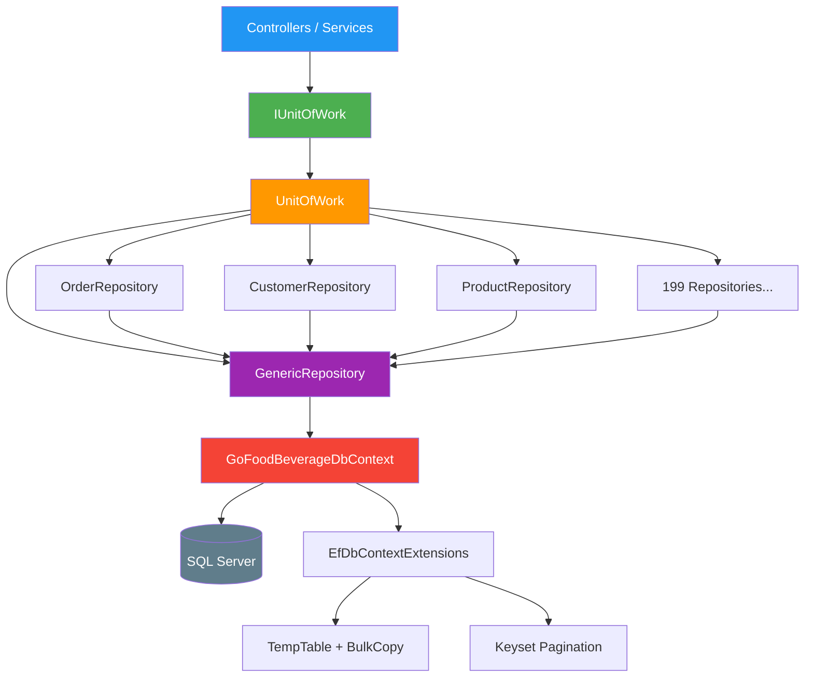

# Senior Full-Stack Developer Interview (.NET Core + ReactJS)

---

## I. .NET Core / C# (Back-end)

### 1. `async/await` khác gì `Task.Run()`? Khi nào dùng cái nào?

> `async/await` dùng cho **I/O-bound** (gọi API, query DB) — không block thread, thread trả về pool trong lúc chờ.
> `Task.Run()` dùng cho **CPU-bound** (tính toán nặng) — đẩy sang background thread.
> Sai lầm phổ biến: dùng `Task.Run()` wrap một async call trong controller → lãng phí thread, không có lợi gì.

### 2. Middleware pipeline hoạt động thế nào? Thứ tự có quan trọng không?

> Request đi qua từng middleware theo thứ tự đăng ký, response đi ngược lại. Thứ tự **rất quan trọng**: Authentication phải trước Authorization, Exception handling phải ở đầu pipeline để bắt mọi lỗi. CORS phải trước routing nếu không preflight request sẽ fail.

### 3. DI Lifetime: `Scoped` vs `Transient` vs `Singleton`? Inject Scoped vào Singleton thì sao?

> - **Singleton**: 1 instance toàn app (cache, config).
> - **Scoped**: 1 instance per request (DbContext, UnitOfWork).
> - **Transient**: mỗi lần inject tạo mới (lightweight stateless service).
>
> Inject Scoped vào Singleton → **Captive Dependency** → Scoped service sống mãi như Singleton → DbContext không bao giờ dispose → memory leak + stale data. Fix: inject `IServiceScopeFactory` rồi tạo scope thủ công.

### 4. `IEnumerable<T>` vs `IQueryable<T>` khi query database?

> - `IQueryable`: build expression tree → translate sang SQL → chạy trên DB server. Filter ở DB.
> - `IEnumerable`: kéo toàn bộ data về memory rồi filter bằng LINQ-to-Objects.
>
> Luôn dùng `IQueryable` khi query DB, chỉ `.ToList()` ở bước cuối. Dùng `IEnumerable` = load hết table vào RAM.

### 5. Design patterns bạn hay dùng trong .NET Core?

> - **Repository + Unit of Work**: abstract DB access, dễ test. Nhưng với EF Core, DbContext đã là UoW + Repository rồi, nên chỉ thêm layer khi cần swap ORM hoặc complex query logic.
> - **Mediator (MediatR)**: tách controller khỏi business logic, mỗi feature 1 handler. Tốt cho CQRS.
> - **Strategy**: inject different implementations qua DI (ví dụ: nhiều payment provider).
> - **Options Pattern**: `IOptions<T>` cho config strongly-typed.

### 6. REST API versioning bạn xử lý thế nào?

> Tôi prefer **URL segment versioning** (`/api/v1/users`) vì rõ ràng nhất, client dễ hiểu. Header versioning (`Api-Version: 2`) cleaner nhưng khó debug/test bằng browser. Dùng `Microsoft.AspNetCore.Mvc.Versioning` package, config `ApiVersionReader`, deprecated version cũ nhưng vẫn giữ 1-2 version trước.

### 7. Clean Architecture bạn tổ chức project thế nào?

> ```
> Solution/
>   Domain/         → Entities, Value Objects, interfaces (0 dependency)
>   Application/    → Use cases, DTOs, validators (depend Domain)
>   Infrastructure/ → EF Core, external services (depend Application)
>   WebAPI/         → Controllers, middleware (depend Application + Infrastructure)
> ```
> Rule: dependency chỉ hướng vào trong. Domain không biết gì về DB hay HTTP.

### 8. API endpoint chạy chậm (> 5s). Debug thế nào?

> 1. **Logging**: check thời gian từng bước (DB, external call, processing).
> 2. **SQL Profiler / EF Core logging**: tìm N+1 queries, missing index, full table scan.
> 3. **Application Insights / MiniProfiler**: xem bottleneck ở đâu.
> 4. Fix phổ biến: thêm index, dùng `Include()` thay vì lazy load, pagination, caching hot data, async external calls song song bằng `Task.WhenAll()`.

### 9. Xử lý batch data lớn (hàng ngàn record)?

> Không dùng `SaveChanges()` trong loop. Dùng **bulk insert** (`EFCore.BulkExtensions` hoặc `SqlBulkCopy`). Nếu transform phức tạp: load data cần thiết 1 lần vào Dictionary, xử lý in-memory, rồi bulk insert. Giảm từ N roundtrips xuống 2-3 queries tổng.

---

## II. ReactJS / TypeScript

### 10. Virtual DOM và khi nào component re-render không cần thiết?

> React tạo Virtual DOM tree mới mỗi render, diff với cây cũ, chỉ update DOM thật ở chỗ khác biệt. Re-render thừa xảy ra khi: parent re-render, context thay đổi, hoặc setState với value mới (dù giá trị giống). Fix: `React.memo` cho component, `useMemo` cho computed value, `useCallback` cho function truyền xuống child.

### 11. `useMemo` vs `useCallback` vs `React.memo` — khi nào KHÔNG nên dùng?

> Không nên dùng khi: component render nhanh, data nhỏ, không truyền callback xuống child list lớn. Memoization có cost (so sánh deps mỗi render). Premature optimization = complexity không cần thiết. Chỉ optimize khi đo được performance issue thực tế (React DevTools Profiler).

### 12. State management trong app React lớn?

> - **Local state** (`useState`): form input, UI toggle.
> - **Context**: theme, auth, low-frequency global state.
> - **Redux/Zustand**: complex state nhiều component share, cần middleware (async), time-travel debug. Tôi prefer **Zustand** vì ít boilerplate hơn Redux, không cần Provider wrapper.
> - Rule: state nào gần component nhất thì để ở đó, đừng global hóa mọi thứ.

### 13. Viết custom hook `useFetch<T>`?

> ```typescript
> function useFetch<T>(url: string) {
>   const [data, setData] = useState<T | null>(null);
>   const [loading, setLoading] = useState(true);
>   const [error, setError] = useState<string | null>(null);
>
>   useEffect(() => {
>     const controller = new AbortController();
>     setLoading(true);
>     fetch(url, { signal: controller.signal })
>       .then(res => { if (!res.ok) throw new Error(res.statusText); return res.json(); })
>       .then(setData)
>       .catch(e => { if (e.name !== 'AbortError') setError(e.message); })
>       .finally(() => setLoading(false));
>     return () => controller.abort(); // cleanup on unmount or url change
>   }, [url]);
>
>   return { data, loading, error };
> }
> ```
> Key: AbortController để cancel request khi component unmount, tránh state update trên unmounted component.

---

## III. Database & SQL

### 14. Top 10 khách hàng mua nhiều nhất 30 ngày — viết query và tối ưu?

> ```sql
> SELECT TOP 10 o.customer_id, SUM(oi.quantity * oi.unit_price) AS total
> FROM Orders o
> JOIN OrderItems oi ON oi.order_id = o.id
> WHERE o.order_date >= DATEADD(DAY, -30, GETDATE())
> GROUP BY o.customer_id
> ORDER BY total DESC;
> ```
> Index cần: `Orders(order_date) INCLUDE (customer_id)` và `OrderItems(order_id) INCLUDE (quantity, unit_price)` — covering index tránh key lookup.

### 15. N+1 problem là gì? Xử lý trong EF Core?

> Load 100 orders, mỗi order lazy load OrderItems → 1 + 100 = 101 queries. Fix: **Eager loading** `.Include(o => o.OrderItems)` → 1-2 queries. Hoặc **Split Query** `.AsSplitQuery()` nếu Include nhiều collection gây Cartesian explosion. Luôn bật EF Core logging trong dev để phát hiện sớm.

### 16. EF Core Migration vs Raw SQL migration trong production?

> EF Migration tiện cho dev, nhưng production tôi prefer **script-based migration** (DbUp, FluentMigrator, hoặc export EF migration sang SQL script bằng `Script-Migration`). Lý do: DBA review được, rollback script rõ ràng, không phụ thuộc vào EF runtime, CI/CD pipeline chạy SQL script đơn giản hơn.

---

## IV. Security

### 17. JWT flow và refresh token rotation?

> 1. User login → server trả **access token** (short-lived, 15min) + **refresh token** (long-lived, 7 days, lưu DB).
> 2. Access token hết hạn → client gửi refresh token lên `/auth/refresh`.
> 3. Server verify refresh token, **revoke token cũ**, issue cặp access + refresh token mới (**rotation**).
> 4. Nếu refresh token cũ bị dùng lại → phát hiện token theft → revoke toàn bộ family → force re-login.
>
> Access token lưu memory (không localStorage). Refresh token lưu httpOnly secure cookie.

### 18. SQL Injection, XSS, CSRF — phòng chống?

> - **SQL Injection**: parameterized queries (EF Core tự xử lý), **KHÔNG BAO GIỜ** string concatenation vào SQL.
> - **XSS**: React tự escape output. Không dùng `dangerouslySetInnerHTML`. Server-side: encode output, CSP headers.
> - **CSRF**: ASP.NET Core `[ValidateAntiForgeryToken]` cho MVC. SPA dùng JWT thì CSRF không phải vấn đề lớn (token không tự động gửi như cookie). Nếu dùng cookie auth → SameSite=Strict.

### 19. Xử lý sensitive data (PII, credentials)?

> - **At rest**: encrypt bằng AES-256. Connection strings, API keys → Azure Key Vault / AWS Secrets Manager, không lưu trong code/config.
> - **In transit**: HTTPS everywhere, TLS 1.2+.
> - **Trong code**: không log PII, mask data trong response (số thẻ chỉ show 4 số cuối), GDPR compliance nếu cần.
> - DB: column-level encryption cho sensitive fields, separate audit log.

---

## V. DevOps / Cloud

### 20. Dockerfile cho .NET Core — multi-stage build?

> ```dockerfile
> # Stage 1: Build
> FROM mcr.microsoft.com/dotnet/sdk:8.0 AS build
> WORKDIR /src
> COPY *.csproj .
> RUN dotnet restore
> COPY . .
> RUN dotnet publish -c Release -o /app
>
> # Stage 2: Runtime
> FROM mcr.microsoft.com/dotnet/aspnet:8.0
> WORKDIR /app
> COPY --from=build /app .
> ENTRYPOINT ["dotnet", "MyApp.dll"]
> ```
> Multi-stage: image build ~700MB (có SDK), image runtime ~200MB (chỉ ASP.NET runtime). Giảm attack surface + deploy size.

### 21. CI/CD pipeline gồm những stage nào?

> ```
> Commit → Build → Unit Test → Code Analysis (SonarQube) → Docker Build
>   → Push Registry → Deploy Staging → Integration Test → Deploy Production
> ```
> Feature branch → PR → merge develop → auto deploy staging. Tag release → deploy production. Rollback: deploy lại image version trước. Blue-green hoặc canary deployment cho zero-downtime.

### 22. Deploy .NET Core + React lên cloud?

> **Option 1 (đơn giản)**: Azure App Service (backend) + Azure Static Web Apps (React).
> **Option 2 (container)**: Docker → AKS/ECS. React build static → CDN (CloudFront/Azure CDN).
> **Option 3 (serverless)**: Azure Functions cho API nhỏ.
> Database: Azure SQL / RDS. Secrets: Key Vault. Logging: Application Insights. CI/CD: GitHub Actions hoặc Azure DevOps.

---

## VI. System Design

### 23. Thiết kế notification real-time?

> **SignalR** cho .NET ecosystem (WebSocket dưới hood, fallback long-polling). Client subscribe vào hub, server push notification. Scale: **Azure SignalR Service** hoặc Redis backplane để nhiều server instance share connections. Notification lưu DB để user xem lại. Unread count cache trong Redis. Mobile: push notification qua Firebase/APNs song song.

### 24. Thiết kế CRM system đơn giản?

> ```
> Tables: Contacts, Companies, Deals, Activities, Users
> Deals: id, contact_id, company_id, stage (enum), value, expected_close_date
> Activities: id, deal_id, contact_id, type (call/email/meeting), note, date
> ```
> API: `GET/POST /api/contacts`, `GET/POST /api/deals`, `PATCH /api/deals/{id}/stage`, `GET /api/deals?stage=negotiation`, `GET /api/dashboard/pipeline` (aggregate by stage). Search: full-text index trên contact name + email.

### 25. Scale từ 100 req/s lên 10,000 req/s?

> 1. **Caching**: Redis cho hot data, response caching cho GET endpoints.
> 2. **Database**: read replicas, connection pooling, optimize queries + index.
> 3. **Horizontal scale**: multiple app instances behind load balancer (sticky session off, stateless app).
> 4. **Async processing**: message queue (RabbitMQ/SQS) cho heavy work, worker service xử lý background.
> 5. **CDN**: static assets + API response caching ở edge.
> 6. **Database sharding** nếu single DB không đủ.

---

## VII. Behavioral

### 26. Kể về lần refactor codebase lớn?

> *(Gợi ý trả lời)*: Mô tả context (monolith 3 năm, God class 5000 dòng), approach (refactor dần bằng Strangler Fig pattern, viết test trước khi tách, feature flag để switch), kết quả (giảm 60% bug rate, deploy time từ 2h xuống 15min). Nhấn mạnh: không big-bang rewrite, refactor từng phần có test coverage.

### 27. Xử lý code review conflict?

> Tập trung vào **code, không phải người**. Nếu bất đồng: đưa ra data/benchmark thay vì opinion. Nếu không quan trọng lắm (style, naming) → follow team convention, đừng block PR vì chuyện nhỏ. Nếu quan trọng (architecture, security) → escalate lên team lead, thảo luận chung.

### 28. PM yêu cầu skip testing vì deadline?

> Không skip test cho critical path. Đề xuất compromise: giảm scope feature thay vì giảm quality. Hoặc: ship MVP có test cho happy path, tech debt ticket cho edge cases, sprint sau trả nợ. Giải thích risk cho PM bằng ngôn ngữ business: "skip test bây giờ = production bug sau 2 tuần = mất 3 ngày hotfix + ảnh hưởng user trust".

---

> **📌 Tip đánh giá**: Senior thật sự sẽ trả lời kèm **trade-offs** và **kinh nghiệm thực tế**, không chỉ lý thuyết sách vở. Hỏi thêm "Bạn đã gặp case này chưa? Xử lý thế nào?" để phân biệt senior thật vs senior trên giấy.


# 🎯 React Senior Interview — Hỏi & Đáp

> **Format:** Interviewer hỏi → Senior trả lời ngắn gọn, đi thẳng vào bản chất.

---

## Phần 1: React Internals

---

### Q1. Virtual DOM hoạt động như thế nào? Tại sao React không thao tác trực tiếp Real DOM?

**Senior:** React tạo một bản sao in-memory của DOM gọi là Virtual DOM. Khi state/props thay đổi, React tạo một Virtual DOM mới, so sánh (diff) với bản cũ bằng **Reconciliation Algorithm**, rồi chỉ cập nhật những node thực sự thay đổi lên Real DOM.

Lý do không thao tác trực tiếp: Real DOM operations rất tốn kém — mỗi lần thay đổi DOM, browser phải recalculate style, layout, repaint. Batching các thay đổi qua Virtual DOM giảm đáng kể số lần browser phải làm việc.

---

### Q2. React Fiber là gì? Nó giải quyết vấn đề gì so với Stack Reconciler cũ?

**Senior:** Fiber là engine reconciliation mới từ React 16. Stack Reconciler cũ xử lý render **đồng bộ** — một khi bắt đầu render tree thì phải chạy hết, block main thread.

Fiber chia render work thành các **unit of work** nhỏ, có thể:
- **Pause** giữa chừng để xử lý user input
- **Prioritize** urgent updates (click, type) trước non-urgent updates (data fetch)
- **Abort** work không còn cần thiết

Đây là nền tảng cho Concurrent Features trong React 18.

---

### Q3. Giải thích cơ chế Diffing Algorithm của React.

**Senior:** React dùng 2 heuristic chính:
1. **Khác type** → tear down cây cũ, build cây mới hoàn toàn.
2. **Cùng type** → so sánh attributes/props, chỉ update phần thay đổi. Với children list → dùng **`key`** để match elements.

Complexity: O(n) thay vì O(n³) của generic tree diff — trade-off accuracy lấy performance.

---

### Q4. Khi nào React quyết định re-render một component? Liệt kê đầy đủ.

**Senior:** 5 trường hợp:
1. **`setState()` / `useState` setter** được gọi
2. **Props thay đổi** (parent truyền props mới)
3. **Parent re-render** → children re-render (dù props không đổi, trừ khi dùng `React.memo`)
4. **Context value thay đổi** → tất cả consumers re-render
5. **`forceUpdate()`** (class component)

> Lưu ý: Re-render ≠ DOM update. React có thể re-render nhưng diff ra không có thay đổi → không touch DOM.

---

## Phần 2: Hooks Nâng Cao

---

### Q5. `useEffect` vs `useLayoutEffect` — khi nào dùng cái nào?

**Senior:**

| | `useEffect` | `useLayoutEffect` |
|---|---|---|
| **Thời điểm chạy** | Sau paint (async) | Sau DOM mutation, trước paint (sync) |
| **Use case** | Data fetching, subscriptions, logging | DOM measurement, scroll position, tooltip positioning |
| **Ảnh hưởng UX** | Không block paint | Block paint → dùng sai sẽ gây jank |

**Rule of thumb:** Luôn dùng `useEffect` trước. Chỉ chuyển sang `useLayoutEffect` khi thấy **visual flicker**.

---

### Q6. Giải thích "stale closure" trong hooks và cách fix.

**Senior:** Khi closure capture giá trị state tại thời điểm render, nhưng callback chạy sau khi state đã thay đổi:

```javascript
// ❌ Bug: count luôn = 0
useEffect(() => {
  const id = setInterval(() => {
    setCount(count + 1); // closure capture count = 0
  }, 1000);
  return () => clearInterval(id);
}, []);

// ✅ Fix 1: Functional update
setCount(prev => prev + 1);

// ✅ Fix 2: useRef để track giá trị mới nhất
const countRef = useRef(count);
countRef.current = count;
setInterval(() => setCount(countRef.current + 1), 1000);

// ✅ Fix 3: Thêm count vào dependency array (nhưng cần clear interval đúng)
```

---

### Q7. `useMemo` và `useCallback` — khi nào KHÔNG nên dùng?

**Senior:** **Không nên dùng khi:**
- Computation **rẻ** (filter array nhỏ, string format) — overhead của memoization > cost của re-compute.
- Component **không được wrap** bởi `React.memo` — memoize callback vô nghĩa vì child vẫn re-render.
- Value/function **không được truyền xuống child** hoặc không nằm trong dependency array khác.

**Nên dùng khi:**
- Expensive computation (sort/filter large array, complex calculation)
- Truyền callback/object cho child đã `React.memo`
- Value nằm trong dependency array của `useEffect` khác

> **Premature optimization is the root of all evil.** Profile trước, optimize sau.

---

### Q8. Custom hook có gì khác so với một function bình thường?

**Senior:** Về bản chất kỹ thuật, custom hook **là** một function bình thường — nhưng tuân theo **Rules of Hooks**:
- Tên bắt đầu bằng `use` (convention để React lint check)
- Có thể gọi các hooks khác bên trong (useState, useEffect, ...)
- Mỗi component gọi hook sẽ có **instance state riêng** — không share state giữa các component

```javascript
function useDebounce(value, delay) {
  const [debounced, setDebounced] = useState(value);
  useEffect(() => {
    const timer = setTimeout(() => setDebounced(value), delay);
    return () => clearTimeout(timer);
  }, [value, delay]);
  return debounced;
}
```

---

### Q9. `useRef` ngoài việc truy cập DOM thì dùng để làm gì?

**Senior:** `useRef` là một **mutable container** tồn tại xuyên suốt lifecycle, **không trigger re-render** khi thay đổi:

- **Lưu previous value:** `prevRef.current = value` trong useEffect
- **Lưu timer/interval ID:** tránh re-create khi re-render
- **Flag để track mount status:** `isMounted.current = true`
- **Lưu instance variable** như class component (any mutable value)

```javascript
// Track previous value
function usePrevious(value) {
  const ref = useRef();
  useEffect(() => { ref.current = value; });
  return ref.current;
}
```

---

### Q10. `useReducer` vs `useState` — ranh giới nào để chọn?

**Senior:**

| Dùng `useState` | Dùng `useReducer` |
|---|---|
| State đơn giản (boolean, string, number) | State phức tạp (object nhiều field liên quan) |
| Ít state transitions | Nhiều action types khác nhau |
| Logic update đơn giản | Next state phụ thuộc vào previous state phức tạp |
| Không cần test logic riêng | Muốn test state logic **tách biệt** khỏi component |

```javascript
// Khi state transitions phức tạp → useReducer rõ ràng hơn
function reducer(state, action) {
  switch (action.type) {
    case 'FETCH_START': return { ...state, loading: true, error: null };
    case 'FETCH_SUCCESS': return { ...state, loading: false, data: action.payload };
    case 'FETCH_ERROR': return { ...state, loading: false, error: action.error };
  }
}
```

---

## Phần 3: Performance Optimization

---

### Q11. Làm sao bạn debug và fix performance issue trong React app?

**Senior:** Quy trình của tôi:

1. **React DevTools Profiler** → xác định component nào re-render nhiều nhất và mất bao lâu
2. **"Highlight updates when components render"** → thấy visual cái nào đang re-render
3. **Chrome Performance tab** → tìm long tasks, layout thrashing
4. **`why-did-you-render`** library → log nguyên nhân re-render chi tiết

Sau khi xác định bottleneck:
- Unnecessary re-render → `React.memo`, `useMemo`, `useCallback`
- Large list → **Virtualization** (react-window, react-virtuoso)
- Heavy computation → **Web Worker** hoặc `useDeferredValue`
- Large bundle → **Code splitting** (`React.lazy` + `Suspense`)

---

### Q12. `React.memo` hoạt động thế nào? Khi nào nó KHÔNG hoạt động?

**Senior:** `React.memo` wrap component với **shallow comparison** trên props. Nếu props không đổi → skip re-render.

**Không hoạt động khi:**
```javascript
// ❌ Object/array mới mỗi render → luôn khác reference
<Child style={{ color: 'red' }} />    // ❌ object mới
<Child items={data.filter(x => x)} /> // ❌ array mới
<Child onClick={() => doSth()} />     // ❌ function mới

// ✅ Fix
const style = useMemo(() => ({ color: 'red' }), []);
const filtered = useMemo(() => data.filter(x => x), [data]);
const onClick = useCallback(() => doSth(), []);
<Child style={style} items={filtered} onClick={onClick} />
```

Cũng không hoạt động khi component dùng **Context** — context value thay đổi thì `React.memo` bị bypass.

---

### Q13. Code splitting và lazy loading trong React — cách implement?

**Senior:**
```javascript
// Route-level splitting (phổ biến nhất)
const Dashboard = React.lazy(() => import('./Dashboard'));
const Settings = React.lazy(() => import('./Settings'));

function App() {
  return (
    <Suspense fallback={<Spinner />}>
      <Routes>
        <Route path="/dashboard" element={<Dashboard />} />
        <Route path="/settings" element={<Settings />} />
      </Routes>
    </Suspense>
  );
}

// Component-level splitting (cho heavy components)
const HeavyChart = React.lazy(() => import('./HeavyChart'));

// Named export splitting
const MyComponent = React.lazy(() =>
  import('./module').then(mod => ({ default: mod.MyComponent }))
);
```

Kết hợp với **Webpack magic comments** để prefetch:
```javascript
const About = React.lazy(() =>
  import(/* webpackPrefetch: true */ './About')
);
```

---

### Q14. Virtualization/Windowing là gì? Khi nào cần dùng?

**Senior:** Chỉ render các items **visible trong viewport**, thay vì render toàn bộ list. Với list 10,000 items, chỉ render ~20-30 items đang nhìn thấy.

**Dùng khi:** List > 100-200 items bắt đầu gây lag.

```javascript
import { FixedSizeList } from 'react-window';

function VirtualList({ items }) {
  return (
    <FixedSizeList
      height={600}
      width="100%"
      itemCount={items.length}
      itemSize={50}
    >
      {({ index, style }) => (
        <div style={style}>{items[index].name}</div>
      )}
    </FixedSizeList>
  );
}
```

Libraries: `react-window` (lightweight), `react-virtuoso` (feature-rich), `@tanstack/react-virtual` (headless).

---

## Phần 4: State Management

---

### Q15. Context API có vấn đề gì về performance? Cách giải quyết?

**Senior:** Khi context value thay đổi, **TẤT CẢ consumers re-render** — dù chúng chỉ dùng một phần nhỏ của value.

```javascript
// ❌ Mỗi khi theme HOẶC user thay đổi → cả 2 consumers re-render
const AppContext = createContext({ theme: 'dark', user: null });

// ✅ Fix 1: Tách context
const ThemeContext = createContext('dark');
const UserContext = createContext(null);

// ✅ Fix 2: Memoize context value
const value = useMemo(() => ({ theme, user }), [theme, user]);
<AppContext.Provider value={value}>

// ✅ Fix 3: Dùng selector pattern (Zustand, Jotai có built-in)
const theme = useStore(state => state.theme); // chỉ re-render khi theme đổi
```

---

### Q16. So sánh Redux Toolkit, Zustand, và Jotai — khi nào chọn cái nào?

**Senior:**

| | Redux Toolkit | Zustand | Jotai |
|---|---|---|---|
| **Kiến trúc** | Flux (single store, reducers, actions) | Single store, hooks-based | Atomic (bottom-up) |
| **Boilerplate** | Trung bình (RTK giảm nhiều) | Rất ít | Rất ít |
| **DevTools** | Xuất sắc | Tốt (middleware) | Tốt |
| **Bundle size** | ~11KB | ~1KB | ~2KB |
| **Khi nào dùng** | App lớn, team lớn, cần strict patterns | App vừa, cần đơn giản | State phân tán, derived state phức tạp |

**Rule of thumb:**
- Team lớn, cần convention → **Redux Toolkit**
- Cần nhanh gọn, ít ceremony → **Zustand**
- State atomic, nhiều derived values → **Jotai**
- Server state → **TanStack Query** (không phải Redux!)

---

### Q17. Server State vs Client State — tại sao cần phân biệt?

**Senior:** Đây là 2 loại state hoàn toàn khác bản chất:

| | Client State | Server State |
|---|---|---|
| **Ownership** | App sở hữu | Server sở hữu, app chỉ cache |
| **Ví dụ** | Theme, UI toggle, form input | User list, products, orders |
| **Tính chất** | Synchronous, predictable | Async, có thể stale, cần refetch |

Dùng **Redux/Zustand** cho client state. Dùng **TanStack Query / SWR** cho server state vì chúng giải quyết:
- Caching & deduplication
- Background refetching
- Stale-while-revalidate
- Pagination & infinite scroll
- Optimistic updates

```javascript
// TanStack Query — clean hơn rất nhiều so với useEffect + useState
const { data, isLoading, error } = useQuery({
  queryKey: ['users'],
  queryFn: () => fetch('/api/users').then(r => r.json()),
  staleTime: 5 * 60 * 1000, // 5 phút
});
```

---

## Phần 5: React 18+ & Concurrent Features

---

### Q18. Automatic Batching trong React 18 khác gì so với React 17?

**Senior:**

```javascript
// React 17: chỉ batch trong event handlers
function handleClick() {
  setCount(c => c + 1);
  setFlag(f => !f);
  // ✅ 1 re-render (batched)
}

setTimeout(() => {
  setCount(c => c + 1);
  setFlag(f => !f);
  // ❌ 2 re-renders (React 17 KHÔNG batch trong setTimeout)
}, 1000);

// React 18: batch EVERYWHERE — event handlers, setTimeout, promises, native events
setTimeout(() => {
  setCount(c => c + 1);
  setFlag(f => !f);
  // ✅ 1 re-render (React 18 tự batch)
}, 1000);

// Muốn opt-out batching → flushSync
import { flushSync } from 'react-dom';
flushSync(() => setCount(c => c + 1)); // re-render ngay
flushSync(() => setFlag(f => !f));      // re-render ngay
```

---

### Q19. `useTransition` và `useDeferredValue` — giải quyết vấn đề gì?

**Senior:** Cả hai đều đánh dấu updates là **non-urgent**, cho phép React ưu tiên urgent updates (typing, clicking) trước.

```javascript
// useTransition — wrap state update
function SearchPage() {
  const [query, setQuery] = useState('');
  const [isPending, startTransition] = useTransition();

  function handleChange(e) {
    setQuery(e.target.value);        // urgent: update input ngay
    startTransition(() => {
      setFilteredList(filter(data, e.target.value)); // non-urgent: có thể delay
    });
  }

  return (
    <>
      <input value={query} onChange={handleChange} />
      {isPending ? <Spinner /> : <ResultList items={filteredList} />}
    </>
  );
}

// useDeferredValue — defer một value
function SearchResults({ query }) {
  const deferredQuery = useDeferredValue(query);
  // deferredQuery "lag behind" query → không block typing
  const results = useMemo(() => filter(data, deferredQuery), [deferredQuery]);
  return <List items={results} />;
}
```

**Khác biệt:** `useTransition` wrap **setter**, `useDeferredValue` wrap **value**. Dùng `useDeferredValue` khi không control được setter (nhận từ props).

---

### Q20. React Server Components (RSC) là gì? Khác gì SSR truyền thống?

**Senior:**

| | SSR | RSC |
|---|---|---|
| **Chạy ở đâu** | Server render → HTML → Client hydrate lại toàn bộ | Component chạy *chỉ* trên server, KHÔNG gửi JS |
| **JS Bundle** | Vẫn gửi toàn bộ JS | Server Components = 0 KB client JS |
| **Interactivity** | Full — sau hydration | Server Components: KHÔNG interactive. Client Components: có |
| **Data fetching** | getServerSideProps / loader | Trực tiếp `await fetch()` trong component |

```javascript
// Server Component (mặc định trong Next.js App Router)
async function ProductPage({ id }) {
  const product = await db.products.findById(id); // truy cập DB trực tiếp
  return <ProductDetails product={product} />;     // render trên server
}

// Client Component — cần 'use client' directive
'use client';
function AddToCartButton({ productId }) {
  const [added, setAdded] = useState(false);
  return <button onClick={() => setAdded(true)}>Add to Cart</button>;
}
```

---

## Phần 6: Patterns & Architecture

---

### Q21. Compound Components pattern — giải thích và cho ví dụ.

**Senior:** Các components chia sẻ implicit state thông qua Context, cho phép user tự do compose UI mà vẫn giữ logic nhất quán:

```javascript
// Usage — clean, declarative API
<Select onChange={handleChange}>
  <Select.Trigger>Choose an option</Select.Trigger>
  <Select.Options>
    <Select.Option value="a">Option A</Select.Option>
    <Select.Option value="b">Option B</Select.Option>
  </Select.Options>
</Select>

// Implementation
const SelectContext = createContext();

function Select({ children, onChange }) {
  const [isOpen, setIsOpen] = useState(false);
  const [selected, setSelected] = useState(null);
  const value = useMemo(
    () => ({ isOpen, setIsOpen, selected, setSelected, onChange }),
    [isOpen, selected, onChange]
  );
  return (
    <SelectContext.Provider value={value}>
      {children}
    </SelectContext.Provider>
  );
}

Select.Trigger = function Trigger({ children }) {
  const { setIsOpen, selected } = useContext(SelectContext);
  return <button onClick={() => setIsOpen(o => !o)}>{selected || children}</button>;
};
// ... Select.Options, Select.Option tương tự
```

**Ưu điểm:** Flexibility cao, user control layout. **Ví dụ thực tế:** Radix UI, Headless UI.

---

### Q22. Render Props vs HOC vs Custom Hooks — evolution ra sao?

**Senior:**

```javascript
// 1. HOC (2015) — wrap component, inject props
const withAuth = (Component) => (props) => {
  const user = useAuth();
  return user ? <Component {...props} user={user} /> : <Login />;
};
// Vấn đề: wrapper hell, prop collision, khó debug

// 2. Render Props (2017) — function as children
<Mouse render={({ x, y }) => <Cursor x={x} y={y} />} />
// Vấn đề: callback hell, awkward JSX nesting

// 3. Custom Hooks (2019+) — ✅ Hiện tại recommended
function useAuth() {
  const [user, setUser] = useState(null);
  useEffect(() => { /* subscribe */ }, []);
  return { user, login, logout };
}
// Sạch, composable, dễ test, không thêm component tree
```

**Kết luận:** Custom Hooks thay thế 90% use cases của HOC và Render Props. HOC vẫn dùng cho cross-cutting concerns đặc biệt (analytics wrapper, error boundary wrapper).

---

### Q23. Error Boundary — tại sao chưa có hooks equivalent?

**Senior:** Error Boundaries bắt lỗi trong **render phase** và **lifecycle methods** — chúng cần `componentDidCatch` và `getDerivedStateFromError` là class methods.

Hooks chạy **sau render**, nên không thể catch lỗi **trong render**. React team chưa giải quyết được vấn đề API design cho hook-based error boundary.

```javascript
class ErrorBoundary extends React.Component {
  state = { hasError: false };

  static getDerivedStateFromError(error) {
    return { hasError: true };
  }

  componentDidCatch(error, info) {
    logErrorToService(error, info.componentStack);
  }

  render() {
    if (this.state.hasError) return <FallbackUI />;
    return this.props.children;
  }
}

// Workaround: dùng library react-error-boundary
import { ErrorBoundary } from 'react-error-boundary';
<ErrorBoundary FallbackComponent={ErrorFallback} onError={logError}>
  <App />
</ErrorBoundary>
```

> **Lưu ý:** Error Boundary KHÔNG catch lỗi trong event handlers, async code, SSR. Những lỗi đó cần try/catch thông thường.

---

### Q24. Controlled vs Uncontrolled Components — khi nào dùng uncontrolled?

**Senior:**
- **Controlled:** React quản lý state qua `value` + `onChange`. Mọi keystroke đi qua React.
- **Uncontrolled:** DOM tự quản lý state, React chỉ đọc qua `ref` khi cần.

**Dùng Uncontrolled khi:**
- Form đơn giản, submit một lần (không cần real-time validation)
- File input (`<input type="file">` bắt buộc uncontrolled)
- Integration với non-React library
- Performance: tránh re-render mỗi keystroke (form cực lớn)

```javascript
// Uncontrolled với React Hook Form — best of both worlds
import { useForm } from 'react-hook-form';

function MyForm() {
  const { register, handleSubmit } = useForm();
  return (
    <form onSubmit={handleSubmit(data => console.log(data))}>
      <input {...register('email')} />
      <button type="submit">Submit</button>
    </form>
  );
}
```

---

## Phần 7: Testing

---

### Q25. Testing strategy cho React app của bạn như thế nào?

**Senior:** Theo **Testing Trophy** (Kent C. Dodds):

```
        E2E        ← ít test, high confidence, chậm
      /      \
   Integration     ← NHIỀU NHẤT test ở đây — test user flows
  /            \
  Unit Tests       ← test pure logic, utils, reducers
  ──────────────
   Static Types    ← TypeScript catches bugs at compile time
```

- **Unit:** Jest — test reducers, utils, custom hooks (`renderHook`)
- **Integration:** React Testing Library — test component behavior từ góc nhìn user
- **E2E:** Playwright / Cypress — test critical user journeys
- **Static:** TypeScript strict mode

```javascript
// ✅ Test behavior, không test implementation
test('user can submit login form', async () => {
  render(<LoginForm />);

  await userEvent.type(screen.getByLabelText(/email/i), 'test@mail.com');
  await userEvent.type(screen.getByLabelText(/password/i), '123456');
  await userEvent.click(screen.getByRole('button', { name: /login/i }));

  expect(await screen.findByText(/welcome/i)).toBeInTheDocument();
});

// ❌ Anti-pattern: test implementation
expect(component.state.isLoggedIn).toBe(true); // test internal state
expect(wrapper.find('LoginForm').prop('onSubmit')).toHaveBeenCalled(); // test props
```

---

### Q26. Làm sao test custom hooks?

**Senior:**

```javascript
import { renderHook, act } from '@testing-library/react';
import { useCounter } from './useCounter';

test('should increment counter', () => {
  const { result } = renderHook(() => useCounter(0));

  expect(result.current.count).toBe(0);

  act(() => {
    result.current.increment();
  });

  expect(result.current.count).toBe(1);
});

// Hook cần Provider → wrapper option
test('hook with context', () => {
  const wrapper = ({ children }) => (
    <AuthProvider>{children}</AuthProvider>
  );
  const { result } = renderHook(() => useAuth(), { wrapper });
  expect(result.current.user).toBeDefined();
});
```

---

### Q27. Mock API calls trong test — approach nào tốt nhất?

**Senior:** **MSW (Mock Service Worker)** — mock ở network level, không cần mock `fetch`/`axios`:

```javascript
import { setupServer } from 'msw/node';
import { http, HttpResponse } from 'msw';

const server = setupServer(
  http.get('/api/users', () => {
    return HttpResponse.json([
      { id: 1, name: 'John' },
      { id: 2, name: 'Jane' },
    ]);
  })
);

beforeAll(() => server.listen());
afterEach(() => server.resetHandlers());
afterAll(() => server.close());

test('loads users', async () => {
  render(<UserList />);
  expect(await screen.findByText('John')).toBeInTheDocument();
  expect(screen.getByText('Jane')).toBeInTheDocument();
});

// Test error case
test('shows error on failure', async () => {
  server.use(
    http.get('/api/users', () => {
      return new HttpResponse(null, { status: 500 });
    })
  );
  render(<UserList />);
  expect(await screen.findByText(/error/i)).toBeInTheDocument();
});
```

**Ưu điểm MSW:** Cùng mock dùng cho test, development, Storybook. Không phụ thuộc implementation (fetch vs axios).

---

## Phần 8: TypeScript + React

---

### Q28. Những TypeScript patterns nào quan trọng nhất trong React?

**Senior:**

```typescript
// 1. Discriminated Unions cho props
type ButtonProps =
  | { variant: 'link'; href: string; onClick?: never }
  | { variant: 'button'; onClick: () => void; href?: never };

function Button(props: ButtonProps) {
  if (props.variant === 'link') return <a href={props.href}>...</a>;
  return <button onClick={props.onClick}>...</button>;
}

// 2. Generic Components
type TableProps<T> = {
  data: T[];
  columns: { key: keyof T; header: string }[];
  renderRow: (item: T) => React.ReactNode;
};
function Table<T>({ data, columns, renderRow }: TableProps<T>) { ... }

// 3. ComponentPropsWithRef — extend native element props
type InputProps = React.ComponentPropsWithRef<'input'> & {
  label: string;
  error?: string;
};
const Input = forwardRef<HTMLInputElement, InputProps>(
  ({ label, error, ...props }, ref) => (...)
);

// 4. as const cho exhaustive type checking
const ROLES = ['admin', 'user', 'guest'] as const;
type Role = typeof ROLES[number]; // 'admin' | 'user' | 'guest'

// 5. Template Literal Types
type Color = 'primary' | 'secondary';
type Size = 'sm' | 'md' | 'lg';
type ButtonClass = `btn-${Color}-${Size}`;
// "btn-primary-sm" | "btn-primary-md" | ... (6 options)
```

---

### Q29. `React.FC` — nên dùng hay không?

**Senior:** **Không nên dùng.** Kể từ React 18, `React.FC`:
- Không còn tự thêm `children` vào props (React 18 bỏ)
- Không hỗ trợ generics
- Thêm implicit return type không cần thiết

```typescript
// ❌ Không recommended
const MyComponent: React.FC<Props> = ({ title }) => { ... };

// ✅ Recommended — explicit, rõ ràng
function MyComponent({ title }: Props): JSX.Element { ... }
// hoặc
const MyComponent = ({ title }: Props) => { ... };
```

---

## Phần 9: System Design & Tình Huống

---

### Q30. Thiết kế một real-time dashboard hiển thị 50 charts, mỗi chart update mỗi giây. Làm sao không lag?

**Senior:** Approach multi-layer:

1. **Data layer:**
   - WebSocket connection duy nhất, server push chỉ data thay đổi (delta updates)
   - Normalize data, chỉ update chart nào có data mới

2. **Rendering layer:**
   - Mỗi chart là một `React.memo` component với custom comparator
   - Dùng `useDeferredValue` cho non-visible charts
   - Canvas-based chart library (không DOM nodes) — lightweight hơn SVG charts

3. **Layout:**
   - Virtualization — chỉ render charts trong viewport
   - `requestAnimationFrame` batching — accumulate updates, render 1 lần/frame

4. **Architecture:**
   ```
   WebSocket → SharedWorker (parse/compute) → Zustand Store → React.memo Charts
   ```
   - SharedWorker tách computation khỏi main thread
   - Zustand với selectors → mỗi chart subscribe đúng slice data của mình

---

### Q31. User report rằng search box bị lag khi gõ. Cách debug và fix?

**Senior:** Step by step:

1. **Profile:** React DevTools Profiler → xem component nào re-render lâu nhất khi gõ
2. **Likely causes:**
   - Filter/search chạy trên large dataset mỗi keystroke
   - Search results re-render toàn bộ list
   - API call mỗi keystroke

3. **Fix theo mức độ:**
```javascript
// Fix 1: Debounce API call
const debouncedQuery = useDebounce(query, 300);
useEffect(() => { fetchResults(debouncedQuery); }, [debouncedQuery]);

// Fix 2: useTransition cho client-side filter
const [isPending, startTransition] = useTransition();
function handleSearch(e) {
  setQuery(e.target.value);       // urgent
  startTransition(() => {
    setResults(filterData(e.target.value)); // non-urgent
  });
}

// Fix 3: Virtualize results list
<VirtualList items={results} itemHeight={40} />

// Fix 4: Web Worker cho heavy computation
const worker = new Worker('./searchWorker.js');
worker.postMessage({ query, data });
worker.onmessage = (e) => setResults(e.data);
```

---

### Q32. Làm sao bạn structure một React project lớn (20+ developers)?

**Senior:**

```
src/
├── app/                    # App-level setup (routes, providers, layouts)
│   ├── routes.tsx
│   ├── providers.tsx
│   └── layouts/
│
├── features/               # Feature-based modules (domain logic)
│   ├── auth/
│   │   ├── components/     # Feature-specific components
│   │   ├── hooks/          # Feature-specific hooks
│   │   ├── api/            # API calls
│   │   ├── store/          # Feature state (Zustand slice / Redux slice)
│   │   ├── types.ts
│   │   └── index.ts        # Public API — chỉ export cái cần thiết
│   ├── dashboard/
│   └── orders/
│
├── shared/                 # Shared across features
│   ├── components/         # Button, Modal, Input, ...
│   ├── hooks/              # useDebounce, useLocalStorage, ...
│   ├── utils/              # Pure utility functions
│   ├── api/                # API client, interceptors
│   └── types/              # Global types
│
└── config/                 # Env, constants, feature flags
```

**Nguyên tắc:**
- Feature modules **không import lẫn nhau** — chỉ import từ `shared/`
- Mỗi feature có `index.ts` làm **public API** — encapsulation
- Monorepo nếu cần: Nx/Turborepo
- Barrel exports ở feature level, KHÔNG ở `shared/` (tree-shaking issues)

---

## Phần 10: Gotcha & Edge Cases

---

### Q33. `key` prop ngoài list rendering thì còn dùng để làm gì?

**Senior:** **Reset component state!** Thay đổi `key` = React unmount component cũ, mount component mới hoàn toàn:

```javascript
// Reset form khi chuyển user
<UserProfile key={userId} user={user} />

// Force re-create animation
<AnimatedComponent key={animationId} />

// Reset uncontrolled input
<input key={formVersion} defaultValue="initial" />
```

Đây là cách **đơn giản nhất** để reset internal state mà không cần `useEffect` cleanup phức tạp.

---

### Q34. Memory leaks phổ biến nhất trong React app?

**Senior:**

```javascript
// 1. ❌ Event listener không cleanup
useEffect(() => {
  window.addEventListener('resize', handler);
  // Thiếu: return () => window.removeEventListener('resize', handler);
}, []);

// 2. ❌ Subscription không unsubscribe
useEffect(() => {
  const sub = eventBus.subscribe('event', handler);
  // Thiếu: return () => sub.unsubscribe();
}, []);

// 3. ❌ setState sau unmount
useEffect(() => {
  fetchData().then(data => {
    setData(data); // component có thể đã unmount
  });
  // Fix: AbortController
  const controller = new AbortController();
  fetchData({ signal: controller.signal }).then(setData).catch(() => {});
  return () => controller.abort();
}, []);

// 4. ❌ setInterval không clear
useEffect(() => {
  const id = setInterval(tick, 1000);
  return () => clearInterval(id);  // PHẢI có
}, []);

// 5. ❌ Closure giữ reference lớn
// Large object bị capture trong closure → GC không thu hồi được
```

---

### Q35. `dangerouslySetInnerHTML` — khi nào dùng và cách dùng an toàn?

**Senior:** Dùng khi cần render raw HTML (CMS content, markdown rendered, rich text editor output).

```javascript
import DOMPurify from 'dompurify';

// ✅ LUÔN sanitize trước khi render
function RichContent({ htmlContent }) {
  const sanitized = DOMPurify.sanitize(htmlContent, {
    ALLOWED_TAGS: ['p', 'b', 'i', 'a', 'ul', 'li', 'br', 'h1', 'h2', 'h3'],
    ALLOWED_ATTR: ['href', 'target'],
  });
  return <div dangerouslySetInnerHTML={{ __html: sanitized }} />;
}

// ❌ NEVER: render unsanitized user input
<div dangerouslySetInnerHTML={{ __html: userInput }} /> // XSS attack vector
```

---

### Q36. Tại sao `{...props}` spreading có thể nguy hiểm?

**Senior:**
```javascript
// ❌ Truyền unknown props xuống DOM → React warning
function Card(props) {
  return <div {...props} />; // nếu props có isActive, onCustomEvent → DOM warning
}

// ✅ Destructure known props, rest cho DOM
function Card({ isActive, onCustomEvent, className, ...domProps }) {
  return (
    <div
      className={`card ${isActive ? 'active' : ''} ${className}`}
      {...domProps}
    />
  );
}
```

---

### Q37. Giải thích sự khác biệt giữa `createElement` và JSX.

**Senior:** JSX chỉ là **syntactic sugar** — Babel/SWC compile JSX thành `createElement` calls:

```javascript
// JSX
<Button color="primary" onClick={handleClick}>
  Submit
</Button>

// Compiled (React 16)
React.createElement(Button, { color: 'primary', onClick: handleClick }, 'Submit');

// Compiled (React 17+ với new JSX transform)
import { jsx as _jsx } from 'react/jsx-runtime';
_jsx(Button, { color: 'primary', onClick: handleClick, children: 'Submit' });
```

React 17+ dùng **new JSX transform** → không cần `import React` ở mỗi file nữa.

---

### Q38. `Suspense` hoạt động như thế nào internally?

**Senior:** Suspense dựa trên cơ chế **throw Promise**:

1. Component con **throw một Promise** khi data chưa sẵn sàng
2. Suspense boundary **catch** Promise đó → render fallback
3. Khi Promise resolve → React **retry render** component con
4. Component con render thành công → Suspense hiển thị content

```javascript
// Đây là cách React.lazy hoạt động internally
function lazy(importFn) {
  let status = 'pending';
  let result;
  const promise = importFn().then(
    module => { status = 'success'; result = module; },
    error => { status = 'error'; result = error; }
  );

  return function LazyComponent(props) {
    if (status === 'pending') throw promise;   // Suspense catches this
    if (status === 'error') throw result;       // Error Boundary catches this
    return <result.default {...props} />;
  };
}
```

---

### Q39. Hydration mismatch là gì? Làm sao tránh?

**Senior:** Khi HTML được server render **khác** với HTML mà client render ra → React warning/error khi hydrate.

```javascript
// ❌ Gây mismatch
function Component() {
  return <p>{Date.now()}</p>;           // khác value server vs client
  return <p>{Math.random()}</p>;         // khác value server vs client
  return <p>{window.innerWidth}</p>;     // window không tồn tại trên server
}

// ✅ Fix
function Component() {
  const [mounted, setMounted] = useState(false);
  useEffect(() => setMounted(true), []);

  if (!mounted) return <p>Loading...</p>; // match server HTML
  return <p>{window.innerWidth}px</p>;    // chỉ render trên client
}

// ✅ React 18: suppressHydrationWarning cho intentional mismatch
<time suppressHydrationWarning>{new Date().toLocaleString()}</time>
```

---

### Q40. Bạn sẽ migrate một React class component codebase sang hooks như thế nào?

**Senior:** **Incremental migration**, KHÔNG rewrite toàn bộ:

1. **Không đụng code đang chạy tốt** — class components vẫn được support
2. **New features viết bằng hooks** — tất cả code mới dùng functional components
3. **Migrate khi có reason** — refactor, bug fix, thêm feature → chuyển sang hooks luôn
4. **Extract logic thành custom hooks trước** — tách business logic ra, component chỉ còn render
5. **Test coverage trước khi migrate** — đảm bảo behavior không đổi

```
Priority order:
1. Shared logic → Custom Hooks (reusable nhất)
2. Simple components (ít state) → Quick wins
3. Complex components → Cẩn thận, test kỹ
4. Components dùng componentDidCatch → GIỮ class (chưa có hook equivalent)
```

> **Tuyệt đối không** tạo PR "migrate tất cả 200 components sang hooks". Đó là recipe for disaster.

---

## Bonus: Quick-Fire Round 🔥

| Câu hỏi | Trả lời ngắn |
|---|---|
| `useId()` dùng để làm gì? | Generate stable unique ID cho accessibility (htmlFor/id), work với SSR |
| React.Fragment vs `<></>` | `<>` không nhận props. `<React.Fragment key={id}>` khi cần key |
| StrictMode làm gì? | Double-invoke effects + render (dev only) để detect side effects |
| Portals dùng khi nào? | Render DOM node ngoài parent (modals, tooltips, dropdowns) |
| `flushSync` dùng khi nào? | Force synchronous re-render (hiếm dùng — DOM measurement sau state update) |
| Tại sao immutability quan trọng? | React dùng reference equality check — mutate object = React không biết thay đổi |
| Synthetic Events là gì? | React wrap native events → normalize cross-browser. React 17+ gắn vào root, không document |
| Prop drilling giải quyết bằng gì? | Context API, Zustand, Component Composition (truyền component thay vì data) |


# 🔍 Phân Tích Database Layer - GoFoodBeverage

## 📐 Kiến Trúc Tổng Quan



---

## ✅ Các Kỹ Thuật Tối Ưu Đã Ứng Dụng

### 1. 🛡️ Soft Delete + Global Query Filter

**File:** [GoFoodBeverageDbContext.cs](file:///d:/src/gofnb/sources/back-end/GoFoodBeverage/GoFoodBeverage.Infrastructure/Contexts/GoFoodBeverageDbContext.cs#L584-L598)

```csharp
Expression<Func<BaseEntity, bool>> filterExpr = x => !x.IsDeleted;
foreach (var entityType in builder.Model.GetEntityTypes())
{
    if (entityType.ClrType.IsAssignableTo(typeof(BaseEntity)))
    {
        var parameter = Expression.Parameter(entityType.ClrType);
        var body = ReplacingExpressionVisitor.Replace(
            filterExpr.Parameters.First(), parameter, filterExpr.Body);
        var lambdaExpression = Expression.Lambda(body, parameter);
        entityType.SetQueryFilter(lambdaExpression);
    }
}
```

> [!IMPORTANT]
> **Tại sao tối ưu?**
> - Tất cả entity kế thừa `BaseEntity` đều **tự động** bị lọc record đã xoá (`IsDeleted = true`)
> - Không cần viết `.Where(x => !x.IsDeleted)` ở mỗi query → **giảm code lặp, tránh bug quên filter**
> - Kết hợp index trên `IsDeleted`: `[Index(nameof(IsDeleted), IsUnique = false)]` → SQL Server tận dụng index để filter nhanh
> - Khi cần query cả record đã xoá, dùng `.IgnoreQueryFilters()`

---

### 2. 🔑 Sequential GUID (Clustered Index Optimization)

**File:** [BaseEntity.cs](file:///d:/src/gofnb/sources/back-end/GoFoodBeverage/GoFoodBeverage.Domain/Base/BaseEntity.cs#L11)

```csharp
[Key]
public Guid Id { get; set; } = new SequentialGuidValueGenerator().Next(null);
```

> [!TIP]
> **Tại sao tối ưu?**
> - GUID thông thường (`Guid.NewGuid()`) hoàn toàn ngẫu nhiên → gây **page split** khi insert vào Clustered Index
> - `SequentialGuidValueGenerator` tạo GUID tuần tự → insert **luôn append vào cuối** B-Tree
> - Giảm **~90% page split**, tăng tốc INSERT đáng kể với bảng lớn (Orders, OrderItems...)
> - Bổ sung thêm extension `GuildExtensions.ToSeq()` để convert manual

---

### 3. ⚡ Temp Table + SqlBulkCopy cho WHERE IN lớn

**File:** [EfDbContextExtensions.cs](file:///d:/src/gofnb/sources/back-end/GoFoodBeverage/GoFoodBeverage.Infrastructure/Extensions/EfDbContextExtensions.cs#L42-L96)

```csharp
// Tự động chuyển sang temp table khi list IDs vượt ngưỡng
var useTempTable = listWhereInIds.Count > DatabaseConstants.MINIMUM_IDS_FOR_CREATE_TEMP_TABLE;

// Tạo temp table + bulk insert
dbContext.Database.ExecuteSqlRaw(
    $"CREATE TABLE {tableTemp} (id uniqueidentifier, PRIMARY KEY (id))");
    
using (SqlBulkCopy bulkcopy = new SqlBulkCopy(sqlCon))
{
    bulkcopy.DestinationTableName = tableTemp;
    using (var dataReader = new ListDataReader<TempTableData>(simpleLookups, columns.ToArray()))
    {
        bulkcopy.WriteToServer(dataReader);
    }
}
```

> [!IMPORTANT]
> **Tại sao tối ưu?**
> - SQL Server giới hạn **~2,100 parameters** trong 1 query. Với list > 2000 IDs, `WHERE Id IN (...)` sẽ **fail**
> - Temp table có PRIMARY KEY → SQL Server dùng **Index Seek** (O(log n)) thay vì scan
> - `SqlBulkCopy` insert hàng nghìn IDs vào temp table chỉ trong **vài milliseconds**
> - `ListDataReader<T>` custom `IDataReader` dùng **compiled Expression Tree** thay vì Reflection → tốc độ đọc property nhanh gấp **5-10x**

---

### 4. 📄 Keyset Pagination (Seek-based Paging)

**File:** [EfDbContextExtensions.cs](file:///d:/src/gofnb/sources/back-end/GoFoodBeverage/GoFoodBeverage.Infrastructure/Extensions/EfDbContextExtensions.cs#L256-L347)

```csharp
// Thay vì OFFSET/FETCH (chậm ở page lớn)
// Sử dụng WHERE Id > lastId + TAKE (nhanh ổn định)
for (int page = 0; page < totalPages; page++)
{
    if (lastIdValue != null && isGuidId)
    {
        items = await query
            .Where(x => ((IGuidKeyEntity)x).Id.CompareTo((Guid)lastIdValue) > 0)
            .Take(batchRead)
            .ToListAsync();
    }
}
```

> [!TIP]
> **Tại sao tối ưu?**
> 
> | Phương pháp | Page 1 | Page 100 | Page 1000 |
> |---|---|---|---|
> | `OFFSET/FETCH` | 5ms | 150ms | 2000ms+ |
> | **Keyset Pagination** | 5ms | 5ms | 5ms |
> 
> - `OFFSET N` phải **scan qua N rows** rồi bỏ → càng page sau càng chậm
> - Keyset chỉ cần `WHERE Id > @lastId` → luôn **Index Seek**, hiệu suất ổn định O(log n)

---

### 5. 🎯 Projection (Select chỉ cột cần thiết)

**File:** [OrderRepository.cs](file:///d:/src/gofnb/sources/back-end/GoFoodBeverage/GoFoodBeverage.Infrastructure/Repositories/OrderRepository.cs#L196-L243)

```csharp
// Thay vì: SELECT * FROM Orders (load hết 50+ columns)
// Chỉ SELECT đúng cột cần dùng:
var order = await orderQuery.Select(order => new Order
{
    Id = order.Id,
    StoreId = order.StoreId,
    Code = order.Code,
    TotalAmount = order.TotalAmount,
    // ... chỉ các field thực sự cần
}).FirstOrDefaultAsync(cancellationToken);
```

> [!NOTE]
> **Tại sao tối ưu?**
> - Bảng `Order` có **50+ columns**, bao gồm cả `RestoreData` (JSON dài)
> - Projection giảm **bandwidth I/O** từ database → app server
> - SQL Server có thể dùng **Covering Index** (chỉ đọc index, không cần quay lại data page)
> - Áp dụng xuyên suốt: `HandleGetOrdersByOrderQuery`, `HandleGetCustomersByCustomerQuery`, `HandleGetOrderItemByOrderQuery`...

---

### 6. 🚫 AsNoTracking (Read-only Query)

**Files:** [GenericRepository.cs](file:///d:/src/gofnb/sources/back-end/GoFoodBeverage/GoFoodBeverage.Infrastructure/Repositories/GenericRepository.cs#L35), [ProductRepository.cs](file:///d:/src/gofnb/sources/back-end/GoFoodBeverage/GoFoodBeverage.Infrastructure/Repositories/ProductRepository.cs#L428-L443)

```csharp
// GenericRepository - paging luôn dùng AsNoTracking
return await dbSet.Skip((pageNumber - 1) * pageSize)
    .Take(pageSize)
    .AsNoTracking()
    .ToListAsync();

// ProductRepository - query read-only
var query = GetAllProducts()
    .Where(x => toppingIds.Contains(x.Id) && x.StoreId == storeId)
    .AsNoTracking()  // ← Không track change = nhanh hơn
    .Select(t => new Product { ... });
```

> [!TIP]
> **Tại sao tối ưu?**
> - EF Core Change Tracker tạo **snapshot copy** cho mỗi entity → tốn memory
> - `AsNoTracking` bỏ qua snapshot → giảm **~40% memory**, tăng tốc **~20-30%** trên query lớn
> - Đặc biệt quan trọng khi load hàng nghìn Orders, Products

---

### 7. 📦 Stored Procedures + Table-Valued Parameter (TVP)

**File:** [CustomerRepository.cs](file:///d:/src/gofnb/sources/back-end/GoFoodBeverage/GoFoodBeverage.Infrastructure/Repositories/CustomerRepository.cs#L125-L161)

```csharp
// Stored Procedure phức tạp chạy trên SQL Server
string sql = "EXEC dbo.SP_CalculateCustomersBySegment @StoreId, @CustomerSegmentId";

// TVP (Table-Valued Parameter) gửi list IDs dạng table
var parmCustomerIds = DataTableViews.TVP_Ids();
foreach (var customerId in customerIdList)
    parmCustomerIds.Rows.Add(customerId);

new SqlParameter { 
    ParameterName = "@ListCustomerIds", 
    Value = parmCustomerIds, 
    SqlDbType = SqlDbType.Structured, 
    TypeName = "dbo.TVP_Ids" 
}
```

> [!NOTE]
> **Tại sao tối ưu?**
> - Logic phân loại customer segment phức tạp → chạy trên SQL Server **gần data** thay vì load toàn bộ lên app
> - TVP gửi list IDs dạng **typed table** thay vì string concatenation → **an toàn SQL Injection**, hiệu suất cao
> - Stored Procedure được **pre-compiled** và cached execution plan

---

### 8. 🧩 Expression Tree Combiner

**File:** [ExpressionExtensions.cs](file:///d:/src/gofnb/sources/back-end/GoFoodBeverage/GoFoodBeverage.Infrastructure/Extensions/ExpressionExtensions.cs#L18-L39)

```csharp
public static Expression<Func<TSource, TDestination>> Combine<TSource, TDestination>(
    params Expression<Func<TSource, TDestination>>[] selectors)
{
    // Merge nhiều selector expression thành 1 → chỉ tạo 1 SQL query
    bindings = bindings.DistinctBy(x => x.Member.Name).ToList();
    return Expression.Lambda<Func<TSource, TDestination>>(
        Expression.MemberInit(firstSelectorBody.NewExpression, bindings), param);
}
```

> [!TIP]
> **Tại sao tối ưu?**
> - Cho phép **compose nhiều selector** thành 1 expression duy nhất
> - EF Core translate thành **1 SQL query** thay vì nhiều round-trip
> - Được dùng trong `AsPageOrderedListAsync` để đảm bảo selector luôn chứa field `Id` cho keyset pagination

---

### Tổng Hợp Các Pattern Bổ Sung

| Pattern | Vị trí | Mô tả |
|---|---|---|
| **Unit of Work** | [UnitOfWork.cs](file:///d:/src/gofnb/sources/back-end/GoFoodBeverage/GoFoodBeverage.Infrastructure/Repositories/UnitOfWork.cs) | Lazy initialization (`??=`), 1 DbContext cho toàn bộ transaction |
| **Audit Trail tự động** | [DbContext.SaveChangesAsync](file:///d:/src/gofnb/sources/back-end/GoFoodBeverage/GoFoodBeverage.Infrastructure/Contexts/GoFoodBeverageDbContext.cs#L608-L660) | Tự động set `CreatedTime`, `LastSavedTime`, `CreatedUser` |
| **Soft Delete override** | [DbContext L647-L655](file:///d:/src/gofnb/sources/back-end/GoFoodBeverage/GoFoodBeverage.Infrastructure/Contexts/GoFoodBeverageDbContext.cs#L647-L655) | DELETE → UPDATE `IsDeleted = true` |
| **Explicit Transaction** | [ProductRepository.UpdateProductAsync](file:///d:/src/gofnb/sources/back-end/GoFoodBeverage/GoFoodBeverage.Infrastructure/Repositories/ProductRepository.cs#L108-L403) | `BeginTransactionAsync` + `CommitAsync` / `RollbackAsync` |
| **Raw SQL DELETE** | [ProductRepository L142](file:///d:/src/gofnb/sources/back-end/GoFoodBeverage/GoFoodBeverage.Infrastructure/Repositories/ProductRepository.cs#L141-L143) | Hard delete qua `ExecuteSqlRawAsync` khi soft delete không phù hợp |
| **Filtered Include** | [ProductRepository L64](file:///d:/src/gofnb/sources/back-end/GoFoodBeverage/GoFoodBeverage.Infrastructure/Repositories/ProductRepository.cs#L64) | `.Include(x => x.ProductPrices.Where(a => !a.IsDeleted))` |
| **Code auto-generation** | [DbContext L472-L473](file:///d:/src/gofnb/sources/back-end/GoFoodBeverage/GoFoodBeverage.Infrastructure/Contexts/GoFoodBeverageDbContext.cs#L471-L473) | SQL Sequence: `NEXT VALUE FOR ProductPrice_Code_SEQ` |
| **PropertySaveBehavior.Ignore** | [DbContext L512-L523](file:///d:/src/gofnb/sources/back-end/GoFoodBeverage/GoFoodBeverage.Infrastructure/Contexts/GoFoodBeverageDbContext.cs#L512-L523) | Bảo vệ field `Code` không bị update sau khi tạo |
| **Keyless Entity** | [DbContext L532-L562](file:///d:/src/gofnb/sources/back-end/GoFoodBeverage/GoFoodBeverage.Infrastructure/Contexts/GoFoodBeverageDbContext.cs#L531-L562) | `HasNoKey().ToView(null)` cho Stored Procedure result |
| **Column Description** | [DbContext L567-L582](file:///d:/src/gofnb/sources/back-end/GoFoodBeverage/GoFoodBeverage.Infrastructure/Contexts/GoFoodBeverageDbContext.cs#L566-L582) | Auto-map `[Description]` attribute → SQL column comment |

---

## 🎤 Câu Hỏi Phỏng Vấn SQL (Dựa Trên Source Code)

### Cơ bản (Junior)

---

**Câu 1: Soft Delete là gì? Tại sao project này không dùng `DELETE` thực sự?**

> 🧠 **Trả lời nhanh (Senior):** Soft Delete dùng cờ `IsDeleted` thay vì xoá thật để giữ audit trail, hỗ trợ restore dữ liệu, và tránh cascade delete phá FK. Project dùng **Global Query Filter** trong `OnModelCreating` để tự động inject `WHERE IsDeleted = 0` vào mọi LINQ query — developer không cần nhớ filter thủ công. Trade-off là bảng phình to, cần archiving job định kỳ.

<details>
<summary>💡 Gợi ý trả lời chi tiết</summary>

- **Soft Delete** = thêm flag `IsDeleted` thay vì xoá row
- Lý do:
  1. **Audit trail** - giữ lại lịch sử, phục vụ báo cáo
  2. **Recovery** - dễ dàng khôi phục dữ liệu bị xoá nhầm
  3. **Foreign Key** - tránh cascade delete phá vỡ dữ liệu liên quan
  4. **Compliance** - tuân thủ quy định lưu trữ dữ liệu
- Project dùng **Global Query Filter** (`SetQueryFilter`) tự động filter `IsDeleted = false` ở mọi query
- Nhược điểm: bảng phình to theo thời gian → cần **archiving strategy**

</details>

---

**Câu 2: `GUID` vs `INT` làm Primary Key. Project sử dụng `SequentialGuidValueGenerator` - nó giải quyết vấn đề gì?**

> 🧠 **Trả lời nhanh (Senior):** Random GUID gây page split nghiêm trọng trên Clustered Index vì insert ở vị trí ngẫu nhiên trong B-Tree. Sequential GUID sinh tuần tự theo thời gian nên luôn append cuối — giảm ~90% page split, fragmentation thấp. So với INT thì GUID lớn hơn (16 vs 4 bytes) nhưng đổi lại được globally unique, phù hợp multi-tenant merge data.

<details>
<summary>💡 Gợi ý trả lời chi tiết</summary>

| Tiêu chí | INT (Identity) | Random GUID | Sequential GUID |
|---|---|---|---|
| Kích thước | 4 bytes | 16 bytes | 16 bytes |
| Page Split | Không | **Rất nhiều** | Gần như không |
| INSERT speed | Nhanh nhất | Chậm (fragmentation) | Nhanh |
| Merge data | Khó (xung đột) | Dễ | Dễ |
| Predict ID | Dễ đoán | Không | Khó |

- Random GUID gây **page split** vì giá trị phân tán → B-Tree liên tục phải chia trang
- Sequential GUID tuần tự theo thời gian → luôn insert cuối → **giảm 90% page split**
- Phù hợp hệ thống F&B multi-tenant: merge data giữa các store dễ dàng, không xung đột ID

</details>

---

**Câu 3: Giải thích sự khác biệt giữa `AsNoTracking()` và query thông thường. Khi nào KHÔNG nên dùng?**

> 🧠 **Trả lời nhanh (Senior):** `AsNoTracking` tắt Change Tracker — EF không tạo snapshot copy nên tiết kiệm ~40% memory và nhanh hơn 20-30%. Dùng cho mọi read-only query (report, list, search). Không dùng khi cần modify entity rồi `SaveChanges()`, hoặc khi cần Identity Map resolution trong cùng DbContext.

<details>
<summary>💡 Gợi ý trả lời chi tiết</summary>

- **Có tracking**: EF tạo snapshot, detect thay đổi → `SaveChanges()` tự biết UPDATE cột nào
- **AsNoTracking**: Bỏ qua snapshot → tiết kiệm memory, nhanh hơn 20-30%
- **Không nên dùng khi**:
  1. Cần update entity sau khi query (vd: `ProductRepository.UpdateProductAsync`)
  2. Cần navigation property lazy loading
  3. Trong cùng transaction cần track nhiều entity liên quan

</details>

---

**Câu 4: Trong `OnModelCreating`, project có đoạn `SetAfterSaveBehavior(PropertySaveBehavior.Ignore)` cho field `Code`. Mục đích là gì?**

> 🧠 **Trả lời nhanh (Senior):** Đảm bảo EF không bao giờ include cột `Code` trong câu lệnh `UPDATE`. Code do DB auto-generate (SQL Sequence), sau khi INSERT thì immutable — giống IDENTITY nhưng cho trường hợp non-identity column. Bảo vệ business logic: mã khách hàng, mã chi nhánh... một khi đã cấp thì không được đổi.

<details>
<summary>💡 Gợi ý trả lời chi tiết</summary>

```csharp
builder.Entity<Customer>().Property(u => u.Code)
    .Metadata.SetAfterSaveBehavior(PropertySaveBehavior.Ignore);
```

- `Code` được database auto-generate (Sequence hoặc Trigger)
- `PropertySaveBehavior.Ignore` = EF **không bao giờ** include column `Code` trong `UPDATE` statement
- Ngăn chặn user hoặc code vô tình thay đổi mã Code đã cấp
- Tương tự concept `IDENTITY` column nhưng cho kiểu string/int không phải identity

</details>

---

### Trung bình (Mid-level)

---

**Câu 5: Tại sao phải dùng Temp Table + SqlBulkCopy thay vì `WHERE Id IN (...)` đơn giản?**

> 🧠 **Trả lời nhanh (Senior):** SQL Server giới hạn ~2100 parameters trong 1 query, list lớn hơn sẽ lỗi. Ngoài ra, IN clause dài khiến query optimizer chọn plan tệ. Giải pháp: bulk insert IDs vào temp table có PK bằng `SqlBulkCopy` (1 round-trip), sau đó JOIN — optimizer dùng Index Seek/Merge Join. Project tự động switch qua threshold, dưới ngưỡng vẫn dùng IN clause cho đơn giản.

<details>
<summary>💡 Gợi ý trả lời chi tiết</summary>

1. **SQL Server giới hạn ~2,100 parameters** → query > 2000 IDs sẽ lỗi
2. `WHERE IN (...)` với list dài → SQL Server tạo **hash match** hoặc **nested loop scan** = chậm
3. Temp table có **PRIMARY KEY** → SQL Server dùng **Merge Join** hoặc **Hash Match** hiệu quả
4. `SqlBulkCopy` ghi hàng nghìn record vào temp table chỉ **1 round-trip** (batch insert)
5. Custom `ListDataReader<T>` dùng **compiled Expression Tree** thay vì `DataTable` → nhanh hơn
6. Có threshold (`MINIMUM_IDS_FOR_CREATE_TEMP_TABLE`) để **tự động** quyết định dùng temp table hay IN clause

</details>

---

**Câu 6: Giải thích Keyset Pagination (seek-based). Tại sao nó nhanh hơn OFFSET/FETCH ở page cuối?**

> 🧠 **Trả lời nhanh (Senior):** OFFSET phải scan rồi discard N rows — O(offset + pageSize), page 1000 mất vài giây. Keyset dùng `WHERE Id > @lastId ORDER BY Id` nên luôn Index Seek trực tiếp — O(log N + pageSize), ổn định ~5ms bất kể page nào. Trade-off: không jump được tới page bất kỳ, chỉ next/prev.

<details>
<summary>💡 Gợi ý trả lời chi tiết</summary>

```sql
-- OFFSET/FETCH (chậm ở page lớn)
SELECT * FROM Orders ORDER BY Id
OFFSET 10000 ROWS FETCH NEXT 100 ROWS ONLY
-- → SQL Server phải scan 10000 rows rồi bỏ đi!

-- Keyset (luôn nhanh)
SELECT TOP 100 * FROM Orders 
WHERE Id > @lastId 
ORDER BY Id
-- → Index Seek trực tiếp tới vị trí @lastId, đọc 100 rows tiếp theo
```

| | OFFSET | Keyset |
|---|---|---|
| Cơ chế | Scan + Skip | Index Seek |
| Độ phức tạp | O(offset + n) | O(log N + n) |
| Page 1000 | 2-5 giây | 5ms |
| Hạn chế | - | Không jump tới page bất kỳ |

</details>

---

**Câu 7: Trong `SaveChangesAsync`, project tự động set `CreatedTime` và `IsDeleted = false` cho entity mới. Cách tiếp cận này có ưu nhược điểm gì?**

> 🧠 **Trả lời nhanh (Senior):** Override `SaveChangesAsync` để tự động fill audit fields (CreatedTime, LastSavedUser) và force `IsDeleted = false` trên INSERT là pattern DRY, đảm bảo consistency xuyên suốt 200+ entities. Nhược điểm: hidden magic gây confuse cho dev mới, iterate toàn bộ ChangeTracker entries có chi phí nhỏ, và tight coupling với HttpContext khiến unit test phải mock.

<details>
<summary>💡 Gợi ý trả lời chi tiết</summary>

**Ưu điểm:**
- **DRY** - không cần set manual ở mỗi service/controller
- **Consistency** - mọi entity đều có audit fields
- **Security** - không phụ thuộc developer nhớ set `IsDeleted = false`

**Nhược điểm:**
- **Hidden behavior** - developer mới không biết logic ngầm → khó debug
- **Performance** - iterate ALL tracked entities mỗi lần save
- **Tight coupling** - phụ thuộc `HttpContext` để lấy `userId`
- **Testing** - cần mock `IHttpContextAccessor`

</details>

---

**Câu 8: Table-Valued Parameter (TVP) là gì? So sánh với cách gửi list qua string concatenation.**

> 🧠 **Trả lời nhanh (Senior):** TVP cho phép gửi 1 structured table (strongly typed) làm parameter vào Stored Procedure, thay vì nối chuỗi. An toàn SQL Injection 100% vì parameterized. Execution plan được cached (string concat mỗi lần tạo plan mới). Gửi được hàng triệu rows không bị giới hạn SQL length. Project dùng `dbo.TVP_Ids` để pass list customer IDs vào SP segment calculation.

<details>
<summary>💡 Gợi ý trả lời chi tiết</summary>

| | String Concatenation | TVP |
|---|---|---|
| SQL Injection | ⚠️ Có rủi ro | ✅ An toàn (parameterized) |
| Execution Plan | Mỗi lần query khác nhau | Cached & reuse |
| Performance | Parse string → chậm | Structured data → nhanh |
| Data Type | String-only | Strongly typed |
| Size limit | URL/SQL length limit | Hàng triệu rows |

Project dùng TVP cho `SP_CalculateCustomersOrderBySegment` khi cần gửi list customer IDs.

</details>

---

**Câu 9: Explain `IgnoreQueryFilters()` - Khi nào cần dùng và rủi ro gì nếu dùng sai?**

> 🧠 **Trả lời nhanh (Senior):** `IgnoreQueryFilters()` bypass Global Query Filter — tắt auto-filter `IsDeleted`. Dùng khi: admin restore data, report lịch sử, hoặc join với temp table/SP results không có field `IsDeleted`. Rủi ro lớn nhất: quên rằng đang bypass → join bảng khác lấy ra "dữ liệu ma" (sản phẩm đã xoá hiện trong đơn hàng). Nên scope hẹp nhất có thể.

<details>
<summary>💡 Gợi ý trả lời chi tiết</summary>

- Global Query Filter tự động thêm `WHERE IsDeleted = 0` vào mọi query
- `IgnoreQueryFilters()` bỏ qua filter này → query **cả record đã xoá**
- **Khi nào cần**:
  1. Admin cần xem/restore dữ liệu đã xoá
  2. Report tổng quan (bao gồm dữ liệu lịch sử)
  3. Stored Procedure results (đã filter ở SP)
  4. Temp table join (không có field `IsDeleted`)
- **Rủi ro**: Nếu quên mà join với bảng khác → **dữ liệu ma** xuất hiện (product đã xoá vẫn hiện trong order)

</details>

---

### Nâng cao (Senior)

---

**Câu 10: Project dùng `ExecuteSqlRawAsync($"DELETE FROM {nameof(ProductOption)} WHERE Id IN({recordIds})")`. Đây có phải SQL Injection không? Làm sao cải thiện?**

> 🧠 **Trả lời nhanh (Senior):** Về lý thuyết có risk vì `recordIds` là string concatenation runtime, dù thực tế risk thấp vì GUIDs có format cố định. Đây không phải best practice. Fix: dùng parameterized query (`@p0, @p1...` + `SqlParameter[]`), hoặc EF 7+ `ExecuteDeleteAsync()`. Table name an toàn vì `nameof()` resolve compile-time.

<details>
<summary>💡 Gợi ý trả lời chi tiết</summary>

- **Hiện tại có rủi ro thấp** vì `recordIds` là list GUID (format cố định), nhưng **không phải best practice**
- `nameof()` compile-time → an toàn, nhưng `recordIds` là runtime string concatenation
- **Cải thiện**:
  ```csharp
  // Tốt hơn: dùng parameterized
  var ids = productOptionDelete.Select((id, i) => $"@p{i}");
  var sql = $"DELETE FROM ProductOption WHERE Id IN ({string.Join(",", ids)})";
  var parameters = productOptionDelete.Select((id, i) => 
      new SqlParameter($"@p{i}", id)).ToArray();
  await _dbContext.Database.ExecuteSqlRawAsync(sql, parameters);
  
  // Hoặc tốt nhất: dùng EF Core bulk delete (EF 7+)
  await _dbContext.ProductOptions
      .Where(x => productOptionDelete.Contains(x.Id))
      .ExecuteDeleteAsync();
  ```

</details>

---

**Câu 11: Phân tích N+1 Query Problem trong `GetOrderDetailDataById` với chuỗi `.Include().ThenInclude()`. Khi nào nên tách query?**

> 🧠 **Trả lời nhanh (Senior):** Nhiều Include trên collection navigation tạo Cartesian explosion — 10 items × 3 options × 2 toppings = 60 rows duplicate trên network. Nên tách khi có ≥2 collection Include cùng level. Project đã tách ở chỗ khác: `HandleGetOrderByOrderQuery` lấy order, `HandleGetOrderItemByOrderQuery` lấy items riêng — mỗi query sạch, không cross-join. Hoặc dùng `AsSplitQuery()` EF 5+ để EF tự tách.

<details>
<summary>💡 Gợi ý trả lời chi tiết</summary>

```csharp
// Hiện tại: 1 query khổng lồ với 10+ JOINS
var order = dbSet.Where(o => o.Id == id && o.StoreId == storeId)
    .Include(o => o.OrderItems).ThenInclude(oi => oi.ProductPrice)
    .Include(o => o.OrderItems).ThenInclude(oi => oi.OrderItemOptions)
    .Include(o => o.OrderItems).ThenInclude(oi => oi.OrderComboItem)
        .ThenInclude(oci => oci.OrderComboProductPriceItems)
            .ThenInclude(ocppi => ocppi.ProductPrice)   // 5 level deep!
```

**Vấn đề:**
- SQL Server tạo **Cartesian Product** giữa các collection → 1 order có 10 items × 3 options × 2 toppings = **60 rows** trả về
- Network transfer **phình to** vì data trùng lặp

**Giải pháp (đã áp dụng ở chỗ khác trong project):**
- Tách thành **multiple queries** (`HandleGetOrderByOrderQuery` + `HandleGetOrderItemByOrderQuery` + ...)
- AsSplitQuery() (EF Core 5+)
- Project dùng pattern `HandleGet*ByOrderQuery` ở phần khác → giảm Cartesian product

</details>

---

**Câu 12: Thiết kế schema cho hệ thống F&B multi-tenant. Tại sao project chọn `StoreId` trên mỗi bảng thay vì database-per-tenant?**

> 🧠 **Trả lời nhanh (Senior):** Shared DB + discriminator column (`StoreId`) giảm cost infra (1 DB vs N DB), migration chạy 1 lần, cross-tenant reporting dễ dàng. Trade-off là data isolation yếu hơn (quên filter StoreId = data leak), và 1 DB có thể thành bottleneck khi scale. Project giảm thiểu risk bằng Global Query Filter, nhưng nếu grow lên enterprise thì cần xem xét hybrid (shard by region).

<details>
<summary>💡 Gợi ý trả lời chi tiết</summary>

| | Shared DB + StoreId | Database per tenant |
|---|---|---|
| Cost | ✅ 1 DB = rẻ | ❌ N DB = đắt |
| Query | Cần filter StoreId | Clean, không cần filter |
| Migration | 1 lần cho tất cả | N lần |
| Cross-tenant report | ✅ Dễ | ❌ Phải aggregate |
| Data isolation | ⚠️ Rủi ro leak | ✅ Hoàn toàn tách biệt |
| Scaling | ⚠️ 1 DB bottleneck | ✅ Scale độc lập |

Project chọn **Shared DB + discriminator column (`StoreId`)** vì:
1. Hàng trăm store nhỏ → tạo hàng trăm DB quá tốn
2. Cross-store reporting (admin dashboard) dễ hơn
3. Dùng Global Query Filter để giảm rủi ro data leak

</details>

---

**Câu 13: `ListDataReader<T>` dùng compiled Expression Tree thay vì Reflection. Giải thích cơ chế và tại sao nhanh hơn.**

> 🧠 **Trả lời nhanh (Senior):** Reflection (`PropertyInfo.GetValue`) mỗi lần gọi tốn ~500ns do phải resolve metadata. Compiled Expression Tree build lambda 1 lần (~1ms), sau đó invoke như native delegate (~5ns) — nhanh gấp 100x. Project cache delegates vào `ConcurrentDictionary` nên amortized cost gần bằng 0. Quan trọng khi `SqlBulkCopy` đọc hàng nghìn rows qua `IDataReader`.

<details>
<summary>💡 Gợi ý trả lời chi tiết</summary>

```csharp
// Reflection (chậm) - mỗi lần gọi phải tìm method info
return _info.GetValue(instance, null); // ~500ns per call

// Compiled Expression (nhanh) - compile 1 lần, gọi như delegate
ParameterExpression instance = Expression.Parameter(classType);
MemberExpression property = Expression.Property(instance, propertyInfo);
UnaryExpression convert = Expression.Convert(property, typeof(object));
dynamicGetter = Expression.Lambda(convert, instance).Compile();
// ~5ns per call (100x faster!)
```

| Cơ chế | Chi phí lần đầu | Chi phí mỗi lần gọi | Phù hợp |
|---|---|---|---|
| Reflection | 0ms | ~500ns | Gọi ít lần |
| Compiled Expression | ~1ms (compile) | ~5ns | **Gọi hàng nghìn lần** |
| Direct code | 0ms | ~2ns | Biết type lúc compile |

Project cache getter vào `ConcurrentDictionary` → compile 1 lần, dùng mãi.

</details>

---

**Câu 14: Trong hệ thống đặt hàng, làm thế nào để handle race condition khi 2 user cùng đặt hàng giảm tồn kho?**

> 🧠 **Trả lời nhanh (Senior):** Dùng atomic UPDATE: `SET Quantity = Quantity - @qty WHERE Quantity >= @qty`, check `@@ROWCOUNT` — nếu 0 thì rollback (hết hàng). Pessimistic: `SELECT WITH (UPDLOCK, ROWLOCK)` trong transaction lock row trước khi update. Optimistic: thêm `WHERE LastSavedTime = @original` detect conflict rồi retry. Project dùng explicit transaction + EF tracking `LastSavedTime` cho optimistic concurrency.

<details>
<summary>💡 Gợi ý trả lời chi tiết</summary>

Project sử dụng:
1. **Explicit Transaction** (`BeginTransactionAsync`) cho update phức tạp
2. **Optimistic Concurrency** (EF tracking `LastSavedTime`)
3. **Database-level locking** qua transaction isolation level

Các cách handle trong SQL:
```sql
-- Pessimistic Locking
BEGIN TRAN
SELECT Quantity FROM MaterialInventoryBranch WITH (UPDLOCK, ROWLOCK)
WHERE MaterialId = @id AND BranchId = @branchId
-- Check & Update
UPDATE MaterialInventoryBranch SET Quantity = Quantity - @qty
WHERE MaterialId = @id AND Quantity >= @qty
IF @@ROWCOUNT = 0 ROLLBACK ELSE COMMIT

-- Optimistic Concurrency (EF style)
UPDATE MaterialInventoryBranch 
SET Quantity = @newQty, LastSavedTime = GETDATE()
WHERE Id = @id AND LastSavedTime = @originalLastSavedTime
-- Nếu @@ROWCOUNT = 0 → conflict → retry
```

</details>

---

**Câu 15: Nếu bảng `Order` có 10 triệu records và query report tổng doanh thu theo ngày chậm, bạn sẽ tối ưu như thế nào?**

> 🧠 **Trả lời nhanh (Senior):** 5 layers: (1) Covering index trên `(StoreId, CreatedTime) INCLUDE (TotalAmount)` cho Index-only scan. (2) Table partitioning theo tháng để partition elimination. (3) Pre-aggregated summary table cập nhật bằng nightly job. (4) Columnstore index cho analytical workload (compression + batch mode). (5) Read replica tách report traffic khỏi OLTP. Thường bắt đầu từ index + summary table, chỉ partition/columnstore khi thực sự cần.

<details>
<summary>💡 Gợi ý trả lời chi tiết</summary>

1. **Index Strategy:**
   ```sql
   CREATE NONCLUSTERED INDEX IX_Order_Report 
   ON [Order] (StoreId, CreatedTime, StatusId) 
   INCLUDE (TotalAmount, OriginalPrice, TotalDiscountAmount)
   -- Covering index → không cần quay lại Clustered Index
   ```

2. **Partitioning** theo tháng/năm:
   ```sql
   CREATE PARTITION FUNCTION PF_OrderDate (datetime)
   AS RANGE RIGHT FOR VALUES ('2025-01-01', '2025-02-01', ...)
   ```

3. **Materialized View / Summary Table:**
   ```sql
   CREATE TABLE DailyOrderSummary (
       StoreId uniqueidentifier,
       Date date,
       TotalRevenue decimal(18,2),
       OrderCount int,
       PRIMARY KEY (StoreId, Date)
   )
   -- Cron job aggregate hàng đêm
   ```

4. **Columnstore Index** cho analytics:
   ```sql
   CREATE NONCLUSTERED COLUMNSTORE INDEX IX_Order_Analytics
   ON [Order] (StoreId, CreatedTime, TotalAmount, StatusId)
   ```

5. **Read Replica**: Route report queries sang replica DB

</details>

---

## Summary Table

| # | Câu hỏi | Độ khó | Chủ đề |
|---|---|---|---|
| 1 | Soft Delete + Global Query Filter | ⭐ Junior | Design Pattern |
| 2 | Sequential GUID vs INT vs Random GUID | ⭐ Junior | Indexing |
| 3 | AsNoTracking | ⭐ Junior | EF Core |
| 4 | PropertySaveBehavior.Ignore | ⭐ Junior | EF Core Config |
| 5 | Temp Table + SqlBulkCopy | ⭐⭐ Mid | Performance |
| 6 | Keyset Pagination | ⭐⭐ Mid | Pagination |
| 7 | Audit Trail trong SaveChanges | ⭐⭐ Mid | Architecture |
| 8 | TVP vs String Concatenation | ⭐⭐ Mid | Security + Performance |
| 9 | IgnoreQueryFilters | ⭐⭐ Mid | EF Core |
| 10 | SQL Injection trong Raw SQL | ⭐⭐⭐ Senior | Security |
| 11 | N+1 Problem & Split Query | ⭐⭐⭐ Senior | Performance |
| 12 | Multi-tenant Architecture | ⭐⭐⭐ Senior | System Design |
| 13 | Expression Tree vs Reflection | ⭐⭐⭐ Senior | Performance |
| 14 | Race Condition & Concurrency | ⭐⭐⭐ Senior | Concurrency |
| 15 | Scaling 10M+ Records | ⭐⭐⭐ Senior | System Design |
